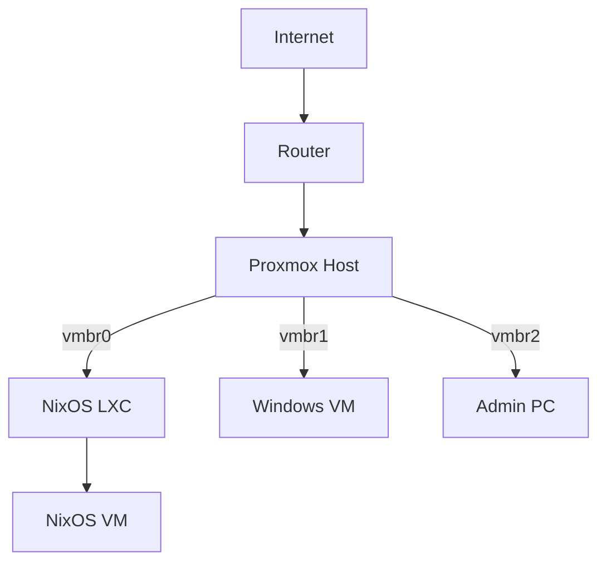
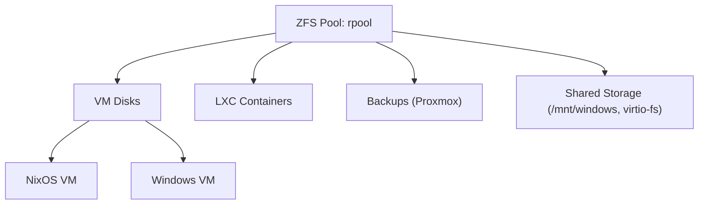
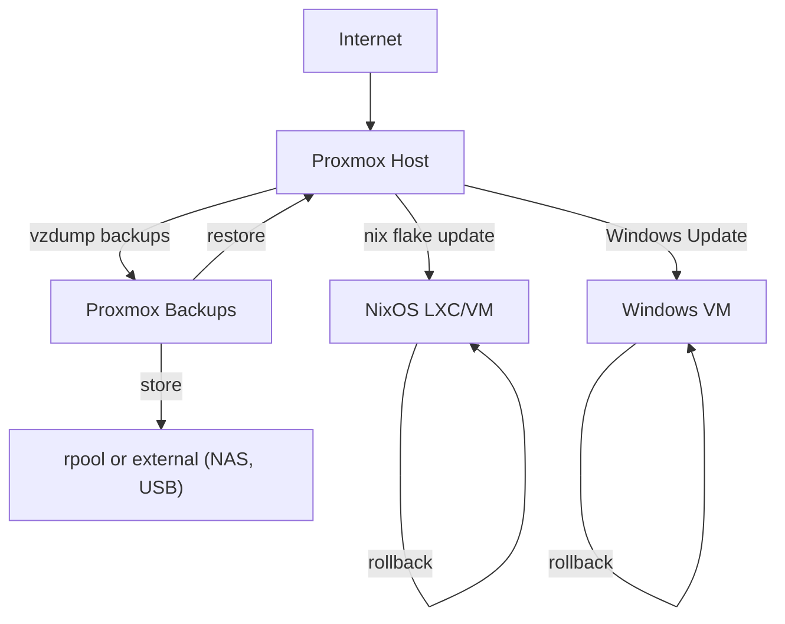

# Architecture Overview

This document provides a high-level overview of the architecture, network topology, storage layout, update and backup flow, and hardware for the Proxmox + NixOS + Windows setup. For more details on usage and configuration, see the [README](README.md) and [USAGE](USAGE.md).

---

## Table of Contents

- [Network Topology](#network-topology)
- [Storage Layout](#storage-layout)
- [Update & Backup Flow](#update--backup-flow)
- [Hardware Example](#hardware-example)
- [PCI Passthrough](#pci-passthrough)

---

## Network Topology

> **Note:** Diagrams use [Mermaid](https://mermaid-js.github.io/) syntax. Rendered diagrams require a compatible Markdown viewer (e.g., GitHub, VS Code, Obsidian).

This section illustrates the logical network connections between Proxmox, NixOS, Windows, and admin systems.



## Storage Layout

This section shows how storage is organized, including ZFS pools, VM disks, containers, backups, and shared storage.



## Update & Backup Flow

This section outlines the flow of updates and backups for both NixOS and Windows systems, as well as how snapshots and restores are managed.



## Hardware Example

> **Note:** The following hardware is a personal example. Adapt these specs to your own needs and available hardware.

| Component | Model/Details |
|-----------|--------------|
| CPU       | AMD Ryzen 5950X (16c/32t, virtualization OK) |
| RAM       | 128GB ECC DDR4 |
| Storage   | 2x2TB NVMe (ZFS mirror), 4x8TB HDD (ZFS RAIDZ1) |
| GPU       | NVIDIA RTX 3060 (Windows passthrough) |
| Network   | 2x 2.5GbE (Intel i225-V) |
| Proxmox   | 8.1 |

```bash
Proxmox Host
├── NixOS LXC (services, immutable)
├── NixOS VM (atomic updates)
└── Windows VM (GPU, apps)
```

For more on adapting the architecture to your hardware, see the [Getting Started](README.md#getting-started) and [Requirements](README.md#requirements) sections in the README.

## PCI Passthrough

This section lists example PCI devices passed through to VMs. Update these values for your own hardware as needed.

- GPU: 01:00.0, 01:00.1 (audio)
- USB controller: 03:00.0

## Making nix-mox Scripts NixOS-Native

### 1. Organize Your Scripts

- Place all scripts you want to package in a directory (e.g., `scripts/linux/`).

---

## 2. Package Each Script as a Nix Derivation

- In your `flake.nix`, under `packages`, use `pkgs.writeShellApplication` for each script.
- **Example:**

```nix
packages = {
  proxmox-update = pkgs.writeShellApplication {
    name = "proxmox-update";
    runtimeInputs = [ pkgs.apt pkgs.pve-manager pkgs.bash pkgs.coreutils ];
    text = builtins.readFile ./scripts/linux/proxmox-update.sh;
  };
  vzdump-backup = pkgs.writeShellApplication {
    name = "vzdump-backup";
    runtimeInputs = [ pkgs.proxmox-backup-client pkgs.qemu pkgs.lxc pkgs.bash pkgs.coreutils pkgs.gawk ];
    text = builtins.readFile ./scripts/linux/vzdump-backup.sh;
  };
  zfs-snapshot = pkgs.writeShellApplication {
    name = "zfs-snapshot";
    runtimeInputs = [ pkgs.zfs pkgs.bash pkgs.coreutils pkgs.gnugrep pkgs.gawk pkgs.gnused pkgs.gnutar ];
    text = builtins.readFile ./scripts/linux/zfs-snapshot.sh;
  };
  nixos-flake-update = pkgs.writeShellApplication {
    name = "nixos-flake-update";
    runtimeInputs = [ pkgs.nix pkgs.bash pkgs.coreutils ];
    text = builtins.readFile ./scripts/linux/nixos-flake-update.sh;
  };
  install = pkgs.writeShellApplication {
    name = "nix-mox-install";
    runtimeInputs = [ pkgs.bash pkgs.coreutils ];
    text = builtins.readFile ./scripts/linux/install.sh;
  };
  uninstall = pkgs.writeShellApplication {
    name = "nix-mox-uninstall";
    runtimeInputs = [ pkgs.bash pkgs.coreutils ];
    text = builtins.readFile ./scripts/linux/uninstall.sh;
  };
  # Add more scripts as needed...
};
```

---

## 3. Expose as Flake Apps (Optional but Recommended)

- Allows users to run scripts with `nix run .#script-name`.

```nix
apps = {
  proxmox-update = {
    type = "app";
    program = "${self.packages.${system}.proxmox-update}/bin/proxmox-update";
  };
  vzdump-backup = {
    type = "app";
    program = "${self.packages.${system}.vzdump-backup}/bin/vzdump-backup";
  };
  # ...repeat for each script
};
```

---

## 4. Update Documentation

- Show users how to:
  - Run scripts: `nix run .#proxmox-update`
  - Install scripts: `nix profile install .#proxmox-update`
  - Add to `environment.systemPackages` in `configuration.nix`:

    ```nix
    environment.systemPackages = with pkgs; [ nix-mox.proxmox-update ];
    ```

---

## 5. Remove /usr/local/sbin Install Logic

- Remove or deprecate the part of your install script that copies files to `/usr/local/sbin`.
- Optionally, keep a legacy install script for non-NixOS users.

---

## 6. Provide a NixOS Module (Optional but Powerful)

- For scripts that should always be present or need systemd integration, provide a NixOS module.
- **Example module structure:**

```nix
# modules/nix-mox.nix
{ config, lib, pkgs, ... }:
{
  options.services.nix-mox = {
    enable = lib.mkEnableOption "Enable nix-mox automation scripts and timers";
  };
  config = lib.mkIf config.services.nix-mox.enable {
    environment.systemPackages = [
      pkgs.nix-mox.proxmox-update
      pkgs.nix-mox.vzdump-backup
      pkgs.nix-mox.zfs-snapshot
      pkgs.nix-mox.nixos-flake-update
      # ...add more as needed
    ];
    # Example: systemd timer for flake update
    systemd.timers.nixos-flake-update = {
      wantedBy = [ "timers.target" ];
      timerConfig.OnCalendar = "daily";
    };
    systemd.services.nixos-flake-update = {
      script = "${pkgs.nix-mox.nixos-flake-update}/bin/nixos-flake-update";
      serviceConfig = {
        Type = "oneshot";
        User = "root";
      };
    };
  };
}
```

- **Usage:**
  1. Add the module to your flake outputs:

    ```nix
    nixosModules.nix-mox = import ./modules/nix-mox.nix;
    ```

  2. In your `configuration.nix`:

    ```nix
    imports = [
      nix-mox.nixosModules.nix-mox
    ];
    services.nix-mox.enable = true;
    ```

---

## 7. Test

- Run `nix build .#proxmox-update` and `nix run .#proxmox-update` to verify.
- Try adding to a NixOS config and rebuilding.

---

## 8. Template for a New Script

For any new script, just add:

```nix
script-name = pkgs.writeShellApplication {
  name = "script-name";
  runtimeInputs = [ pkgs.bash pkgs.coreutils ]; # add more as needed
  text = builtins.readFile ./scripts/linux/script-name.sh;
};
```

And (optionally) add to `apps` as above.

---

## Summary Table

| Step | Action | Result |
|------|--------|--------|
| 1 | Write Nix derivations for scripts | Scripts are Nix packages |
| 2 | Expose in flake outputs | Easy install/run via Nix |
| 3 | Update docs | Users know how to use scripts |
| 4 | (Optional) NixOS module | Systemd/timers, etc. |
| 5 | Remove legacy install | No more /usr/local/sbin |

---

This plan will make all your scripts NixOS-native, reproducible, and easy to use for all Nix users!
