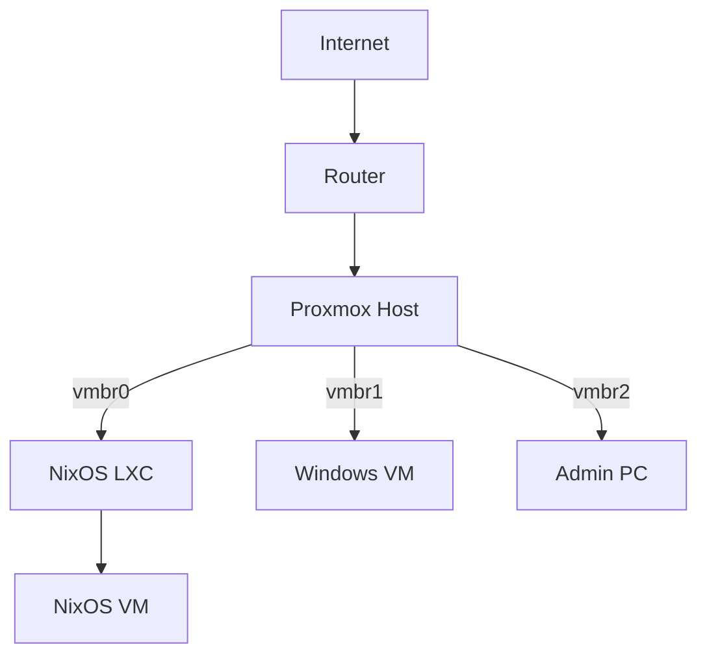
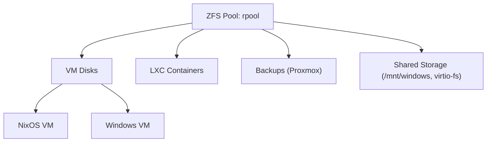
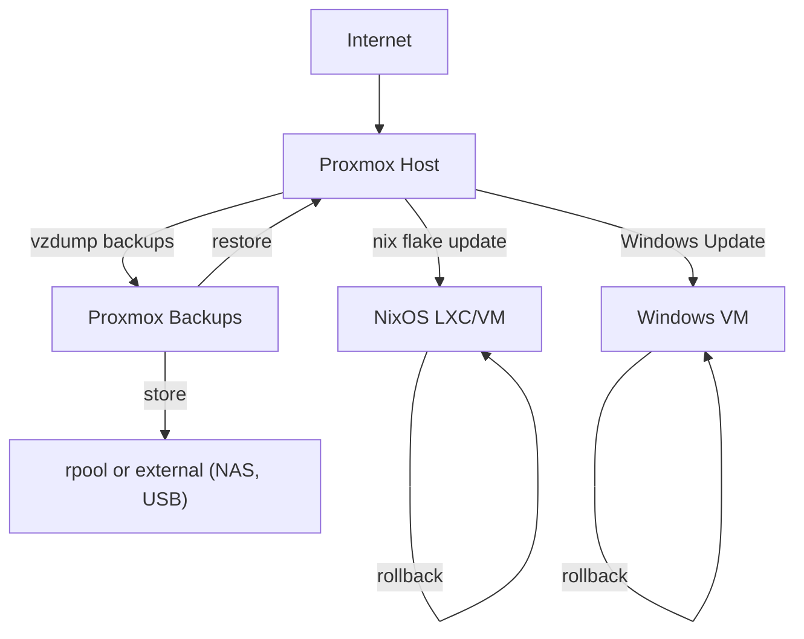

# Architecture Overview

This document provides a high-level overview of the architecture, network topology, storage layout, update and backup flow, and hardware for the Proxmox + NixOS + Windows setup. For usage and configuration details, see the [USAGE.md](USAGE.md) and [README.md](README.md).

---

## Table of Contents

- [Network Topology](#network-topology)
- [Storage Layout](#storage-layout)
- [Update & Backup Flow](#update--backup-flow)
- [Hardware Example](#hardware-example)
- [PCI Passthrough](#pci-passthrough)
- [Making nix-mox Scripts NixOS-Native](#making-nix-mox-scripts-nixos-native)

---

## Network Topology

> **Note:** Diagrams use [Mermaid](https://mermaid-js.github.io/) syntax. Rendered diagrams require a compatible Markdown viewer (e.g., GitHub, VS Code, Obsidian).

This section illustrates the logical network connections between Proxmox, NixOS, Windows, and admin systems.



## Storage Layout

This section shows how storage is organized, including ZFS pools, VM disks, containers, backups, and shared storage.



## Update & Backup Flow

This section outlines the flow of updates and backups for both NixOS and Windows systems, as well as how snapshots and restores are managed.



## Hardware Example

> **Note:** The following hardware is a personal example. Adapt these specs to your own needs and available hardware.

| Component | Model/Details |
|-----------|--------------|
| CPU       | AMD Ryzen 5950X (16c/32t, virtualization OK) |
| RAM       | 128GB ECC DDR4 |
| Storage   | 2x2TB NVMe (ZFS mirror), 4x8TB HDD (ZFS RAIDZ1) |
| GPU       | NVIDIA RTX 3060 (Windows passthrough) |
| Network   | 2x 2.5GbE (Intel i225-V) |
| Proxmox   | 8.1 |

```bash
Proxmox Host
├── NixOS LXC (services, immutable)
├── NixOS VM (atomic updates)
└── Windows VM (GPU, apps)
```

For more on adapting the architecture to your hardware, see the [Getting Started](README.md#getting-started) and [Requirements](README.md#requirements) sections in the README.

## PCI Passthrough

This section lists example PCI devices passed through to VMs. Update these values for your own hardware as needed.

- GPU: 01:00.0, 01:00.1 (audio)
- USB controller: 03:00.0

## Making nix-mox Scripts NixOS-Native

For packaging and exposing scripts as Nix derivations and flake apps, see the detailed instructions in [USAGE.md](USAGE.md#using-the-nixos-module-optional) and your `flake.nix`.
