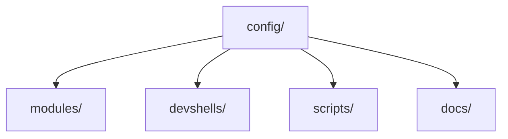

# nix-mox

> A comprehensive NixOS configuration framework for devs, sysadmins, and power users.

[](https://nixos.org/)
[](https://opensource.org/licenses/MIT)
[](https://nixos.wiki/wiki/Flakes)
[/badge.svg)](https://github.com/Hydepwns/nix-mox/actions/workflows/ci.yml)
[](https://codecov.io/gh/Hydepwns/nix-mox)
[](https://github.com/Hydepwns/nix-mox/actions)
[](https://github.com/Hydepwns/nix-mox/actions)

## Quick Start

```bash
git clone https://github.com/Hydepwns/nix-mox.git
cd nix-mox
./scripts/setup-wizard.nu
```

See the [Quick Start Guide](docs/USAGE.md) for more options.

## Features

- Modular NixOS fragments
- Dev shells for all platforms
- Gaming, security, messaging, and more
- [Full feature list →](docs/USAGE.md)

## Project Structure



See [Architecture](docs/architecture/ARCHITECTURE.md) for details.

## Documentation

- [Usage Guide](docs/USAGE.md)
- [Contributing](docs/CONTRIBUTING.md)
- [Architecture](docs/architecture/ARCHITECTURE.md)
- [Cachix Cache](https://app.cachix.org/cache/nix-mox)
- [Local Test Workflow](https://github.com/Hydepwns/nix-mox/actions/workflows/test-local.yml) — manual/experimental

## CI/CD

- [CI Status](https://github.com/Hydepwns/nix-mox/actions/workflows/ci.yml)

## License

MIT — see [LICENSE](LICENSE)
