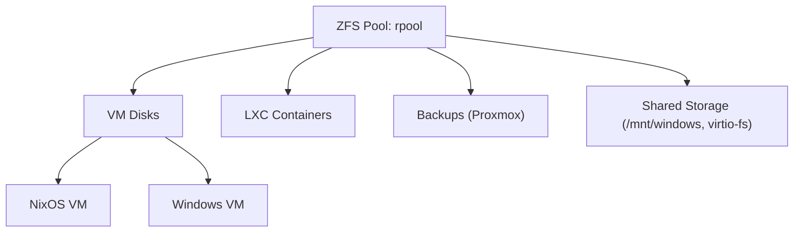

# Proxmox + NixOS + Windows: Quick Reference

_This is a quick reference for setting up Proxmox + NixOS + Windows. It is not a complete guide._

This is a _work in progress_, primarily for my personal build because windows is a pain to setup.

## Quick Start

1. **Clone the repository:**

   ```bash
   git clone https://github.com/hydepwns/nix-mox.git
   cd nix-mox
   ```

2. **Review and edit scripts/configs as needed for your environment.**
3. **Make scripts executable:**

   ```bash
   chmod +x scripts/*.sh
   ```

4. **Deploy scripts:**
   - Proxmox: Copy scripts to `/usr/local/sbin/` or `/root/`
   - NixOS: Copy `nixos-flake-update.sh` to `/etc/nixos/`
5. **Set up systemd timers and cron jobs as described below.**
6. **Run scripts manually to verify setup:**

   ```bash
   sudo ./scripts/proxmox-update.sh
   sudo ./scripts/zfs-snapshot.sh
   sudo ./scripts/vzdump-backup.sh
   sudo ./scripts/nixos-flake-update.sh
   ```

## Table of Contents

- [Host Requirements](#host-requirements)
- [NixOS on Proxmox](#nixos-on-proxmox)
- [Windows on Proxmox](#windows-on-proxmox)
- [Networking](#networking)
- [Shared Storage](#shared-storage)
- [Security](#security)
- [Monitoring & Updates](#monitoring--updates)
- [Hardware (Example)](#hardware-example)
- [Network Topology](#network-topology)
- [Storage Layout](#storage-layout)
- [Update & Backup Flow](#update--backup-flow)
- [Automation Scripts](#automation-scripts)
- [Security Best Practices](#security-best-practices)
- [References](#references)

## Host Requirements

- Proxmox VE 7+ (IOMMU on for passthrough)
- Keep host updated

## NixOS on Proxmox

### LXC (Container)

- Download LXD image: [Hydra](https://hydra.nixos.org/job/nixos/release-*/nixos.lxdContainerImage.x86_64-linux/latest)
- Upload via Proxmox UI → CT Templates
- Create:

  ```bash
  pct create <VMID> local:vztmpl/nixos-*.tar.xz \
    --ostype unmanaged --features nesting=1 \
    --net0 name=eth0,bridge=vmbr0,ip=dhcp
  ```

- Set root password, SSH keys

### VM (Declarative)

- Use [nixos-generators](https://github.com/nix-community/nixos-generators):

  ```nix
  { config, ... }: {
    imports = [ <nixpkgs/nixos/modules/profiles/qemu-guest.nix> ];
    services.qemuGuest.enable = true;
  }
  ```

  ```bash
  nixos-generate -f proxmox -c configuration.nix
  ```

- Upload `.vma.zst`, create VM, attach disk
- Remote update:

  ```bash
  nixos-rebuild switch --flake .#vm --target-host root@proxmox
  ```

### Distroless NixOS (OCI/Container)

- Minimal image:

  ```nix
  pkgs.dockerTools.buildImage {
    name = "distroless-app";
    config = { Cmd = [ "${pkgs.nginx}/bin/nginx" "-g" "daemon off;" ]; };
  }
  ```

- Multi-stage:

  ```nix
  let buildEnv = pkgs.buildEnv { ... };
      runtimeEnv = pkgs.runtimeOnlyDependencies buildEnv;
  in pkgs.dockerTools.buildImage { copyToRoot = runtimeEnv; }
  ```

- Flake config:

  ```nix
  outputs = { nixpkgs, ... }: {
    nixosConfigurations.my-container = nixpkgs.lib.nixosSystem {
      system = "x86_64-linux";
      modules = [ ({ ... }: {
        environment.systemPackages = with pkgs; [ nginx ];
        system.stateVersion = "24.11";
      }) ];
    };
  };
  ```

## Windows on Proxmox

- Create VM (UEFI, SCSI, VirtIO, attach ISOs)
- PCI passthrough (GPU):

  ```bash
  -device vfio-pci,host=01:00.0,multifunction=on
  ```

- QEMU guest agent

## Networking

- Bridges: vmbr0 (NixOS), vmbr1 (Windows), vmbr2 (Mgmt)
- Isolate traffic

## Shared Storage

- virtio-fs:

  ```nix
  virtualisation.sharedDirectories = {
    win-share = { source = "/mnt/windows"; target = "/win-mount"; };
  };
  ```

## Security

- Read-only rootfs:

  ```nix
  fileSystems."/".options = [ "ro" "nosuid" "nodev" ];
  ```

- Non-root services:

  ```nix
  users.users.nginx = { isSystemUser = true; group = "nginx"; };
  ```

- SBOM:

  ```bash
  nix store make-content-addressable /nix/store/...-nginx-* --rewrite-outputs > sbom.json
  ```

## Monitoring & Updates

- Unified logging:

  ```nix
  services.journald.extraConfig = ''
    ForwardToSyslog=yes
    MaxLevelSyslog=debug
  '';
  ```

- Auto-upgrade:

  ```nix
  system.autoUpgrade = {
    enable = true;
    flake = "github:user/nix-config#my-container";
    dates = "daily";
  };
  ```

## Hardware (Example)

| Component | Model/Details |
|-----------|--------------|
| CPU       | AMD Ryzen 5950X |
| RAM       | 128GB ECC DDR4 |
| Storage   | 2x2TB NVMe (ZFS mirror), 4x8TB HDD (ZFS RAIDZ1) |
| GPU       | NVIDIA RTX 3060 (Windows passthrough) |
| Network   | 2x 2.5GbE (Intel i225-V) |
| Proxmox   | 8.1 |

```bash
Proxmox Host
├── NixOS LXC (services, immutable)
├── NixOS VM (atomic updates)
└── Windows VM (GPU, apps)
```

## My Hardware

- CPU: AMD Ryzen 5950X (16c/32t, virtualization OK)
- RAM: 128GB ECC DDR4
- Storage: 2x2TB NVMe (ZFS mirror), 4x8TB HDD (ZFS RAIDZ1)
- GPU: NVIDIA RTX 3060 (Windows passthrough)
- Network: 2x 2.5GbE (Intel i225-V)
- Proxmox: 8.1

### PCI Passthrough

- GPU: 01:00.0, 01:00.1 (audio)
- USB controller: 03:00.0

## Network Topology

```mermaid
flowchart TD
    Internet --> Router --> "Proxmox Host"
    "Proxmox Host" -->|vmbr0| "NixOS LXC"
    "Proxmox Host" -->|vmbr1| "Windows VM"
    "Proxmox Host" -->|vmbr2| "Admin PC"
    "NixOS LXC" --> "NixOS VM"
```

## Storage Layout



## Update & Backup Flow

```mermaid
flowchart TD
    Internet --> "Proxmox Host"
    "Proxmox Host" -->|updates| "Proxmox Host"
    "Proxmox Host" -->|nix flake update| "NixOS LXC/VM"
    "NixOS LXC/VM" -->|nixos-rebuild switch| "NixOS LXC/VM"
    "NixOS LXC/VM" -->|ZFS snapshot| "NixOS LXC/VM"
    "Proxmox Host" -->|Windows Update| "Windows VM"
    "Windows VM" -->|QEMU guest agent| "Windows VM"
    "Windows VM" -->|ZFS snapshot| "Windows VM"
    "Proxmox Host" -->|vzdump backups| "Proxmox Backups"
    "Proxmox Backups" -->|store| "rpool or external (NAS, USB)"
    "Proxmox Backups" -->|restore| "Proxmox Host"
    "NixOS LXC/VM" -->|rollback| "NixOS LXC/VM"
    "Windows VM" -->|rollback| "Windows VM"
```

- Proxmox: auto/scheduled vzdump backups, manual or auto updates
- NixOS: atomic upgrades, rollback via ZFS or nix
- Windows: manual update, snapshot before/after major changes
- Store backups on ZFS pool, external NAS, or cloud

### Automation Scripts

- **Proxmox Host Updates (cron):**

  ```bash
  apt update && apt -y dist-upgrade && apt -y autoremove
  pveupdate && pveupgrade
  ```

- **NixOS Flake Update & Rebuild (systemd timer):**

  ```bash
  nix flake update /etc/nixos
  nixos-rebuild switch --flake /etc/nixos#<hostname>
  ```

- **ZFS Snapshots (cron):**

  ```bash
  zfs snapshot -r rpool@$(date +%Y-%m-%d-%H%M)
  zfs list -t snapshot
  zfs destroy rpool@old-snapshot
  ```

- **Proxmox vzdump Backups:**
  _(Script and schedule with cron for retention)_

  ```bash
  vzdump 100 --storage backup --mode snapshot --compress zstd
  ```

### Deployment

1. Make scripts executable:

   ```bash
   chmod +x proxmox-update.sh nixos-flake-update.sh zfs-snapshot.sh vzdump-backup.sh
   ```

2. Deploy scripts:
   - Proxmox: `/usr/local/sbin/` or `/root/`
   - NixOS: `/etc/nixos/`
3. Set up NixOS flake update timer:

   ```bash
   sudo cp nixos-flake-update.sh /etc/nixos/
   sudo cp nixos-flake-update.service /etc/systemd/system/
   sudo cp nixos-flake-update.timer /etc/systemd/system/
   sudo systemctl daemon-reload
   sudo systemctl enable --now nixos-flake-update.timer
   ```

4. Set up cron jobs (Proxmox):

   ```cron
   0 2 * * * /root/proxmox-update.sh
   0 * * * * /root/zfs-snapshot.sh
   0 3 * * * /root/vzdump-backup.sh
   ```

5. Verify logs: `/var/log/*update.log`, `/var/log/*snapshot.log`, etc.
6. Test: Run scripts manually, confirm timers/cron
7. (Optional) Add notifications (email, Matrix, Slack)

## Security Best Practices

- Proxmox UI: 2FA, restrict to mgmt VLAN
- Firewall rules on all bridges
- ZFS snapshots for rollback
- Regularly update all systems
- Use `age` or `sops` for secrets in NixOS
- Monitor with Prometheus, alert to email/Matrix/Slack

## References

- [mtlynch.io](https://mtlynch.io/notes/nixos-proxmox/)
- [Joshuamlee](https://www.joshuamlee.com/nixos-proxmox-vm-images/)
- [nixos-generators](https://github.com/nix-community/nixos-generators)
- [Distroless Nix](https://tmp.bearblog.dev/minimal-containers-using-nix/)
- [Reddit: NixOS/Proxmox](https://www.reddit.com/r/NixOS/comments/16r92n9/tutorial_running_nixos_on_a_proxmox_vm_server/)
