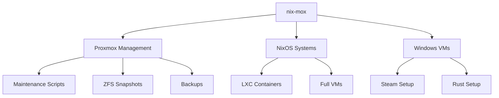
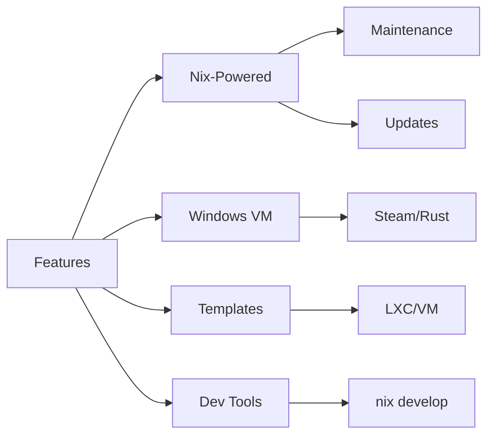
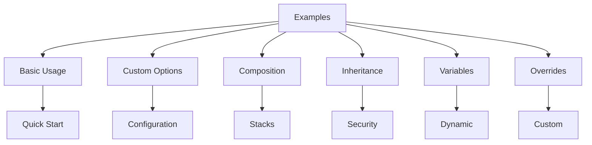

# nix-mox

Proxmox templates + NixOS workstation + Windows gaming automation

## Project Structure

```bash
nix-mox/
├── .github/           # GitHub workflows and templates
├── config/           # Configuration files
├── docs/             # Documentation
│   ├── guides/      # User guides
│   ├── api/         # API documentation
│   ├── examples/    # Example configurations
│   └── development/ # Development documentation
├── lib/              # Library code and utilities
├── modules/          # NixOS modules
│   ├── core/        # Core functionality
│   ├── services/    # Service-specific modules
│   └── storage/     # Storage-related modules
├── packages/         # Package definitions
│   ├── linux/       # Linux packages
│   └── windows/     # Windows packages
├── scripts/          # Scripts
│   ├── core/        # Core scripts
│   ├── handlers/    # Event handlers
│   ├── lib/         # Script utilities
│   ├── linux/       # Linux scripts
│   └── windows/     # Windows scripts
├── shells/           # Development shells
├── templates/        # Templates
│   ├── nixos/       # NixOS templates
│   ├── windows/     # Windows templates
│   └── common/      # Shared template components
└── tests/            # Tests
    ├── linux/       # Linux-specific tests
    ├── windows/     # Windows-specific tests
    ├── integration/ # Integration tests
    └── unit/        # Unit tests
```

## Features

- Proxmox VM templates
- NixOS workstation configuration
- Windows gaming automation
- ZFS snapshot management
- Automated system updates

## Installation

### NixOS

Add to your `flake.nix`:

```nix
{
  inputs.nix-mox.url = "github:yourusername/nix-mox";
  
  outputs = { self, nixpkgs, nix-mox, ... }: {
    nixosConfigurations.your-host = nixpkgs.lib.nixosSystem {
      modules = [
        nix-mox.nixosModules.nix-mox
      ];
    };
  };
}
```

### Non-NixOS

```bash
nix profile install github:yourusername/nix-mox
```

## Development

1. Install Nix:

   ```bash
   sh <(curl -L https://nixos.org/nix/install) --daemon
   ```

2. Enter the development shell:

   ```bash
   nix develop
   ```

3. Run tests:

   ```bash
   nu scripts/core/run-tests.nu
   ```

## Contributing

See [CONTRIBUTING.md](CONTRIBUTING.md) for guidelines.

## License

MIT



## 🚀 Quick Start

```bash
# Clone & enter
git clone https://github.com/hydepwns/nix-mox.git
cd nix-mox

# Explore available tools
nix flake show

# Run a script
nix run .#proxmox-update
```

## 🌟 Core Features



### 🛠️ Key Components

- **Nix Automation**
  - Proxmox maintenance scripts
  - NixOS system updates
  - System-wide module integration

- **Windows VM Tools**
  - Automated Steam/Rust setup
  - Scheduled task integration
  - Gaming VM optimization

- **Templates**
  - NixOS LXC containers
  - Full VM deployments
  - ZFS/Docker/Monitoring

- **Development**
  - `nix develop` environment
  - Nushell test suite
  - CI/CD pipeline

## 📚 Documentation

- [**USAGE.md**](./docs/USAGE.md) - Installation & usage
- [**ARCHITECTURE.md**](./docs/ARCHITECTURE.md) - System design
- [**ROADMAP.md**](./docs/ROADMAP.md) - Future plans

## 🎯 Examples

Check out our comprehensive examples in [**nixamples**](./docs/nixamples/):



### Quick Links

- [Basic Usage](./docs/nixamples/01-basic-usage/) - Get started quickly
- [Custom Options](./docs/nixamples/02-custom-options/) - Configure your setup
- [Template Composition](./docs/nixamples/03-composition/) - Build complex stacks
- [Template Inheritance](./docs/nixamples/04-inheritance/) - Extend templates
- [Template Variables](./docs/nixamples/05-variables/) - Dynamic configuration
- [Template Overrides](./docs/nixamples/06-overrides/) - Customize templates

## 🧪 Testing

```bash
# Run all tests
nu scripts/run-tests.nu

# Verbose output
nu scripts/run-tests.nu --verbose
```

## About

nix-mox provides automation for Proxmox hosts, NixOS systems, and Windows VMs using Nix Flakes and Nushell scripts. All tools are available via `nix run` with a consistent development environment through `nix develop`.
