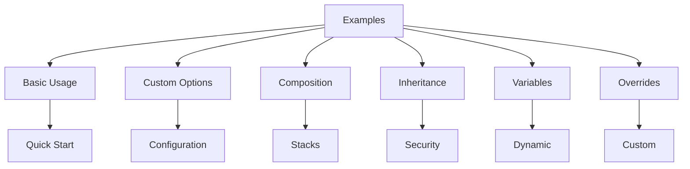

# nix-mox

> Proxmox templates + NixOS workstation + Windows gaming automation

## Table of Contents

- [Overview](#overview)
- [Features](#features)
- [Installation](#installation)
  - [Prerequisites](#prerequisites)
  - [Optional Dependencies](#optional-dependencies)
  - [Installation Methods](#installation-methods)
- [Usage](#usage)
- [Development](#development)

## Overview

nix-mox is a comprehensive toolkit for managing Proxmox environments, NixOS workstations, and Windows gaming setups. It provides automation scripts, templates, and configurations to streamline your infrastructure management.

## Features

- 🖥️ **Proxmox Management**
  - Automated VM and container templates
  - Backup and snapshot management
  - Network configuration tools

- 🎮 **Windows Gaming**
  - Automated Steam and Rust installation
  - Performance optimization scripts
  - Gaming VM templates

- 🔧 **NixOS Integration**
  - System configuration modules
  - Development environment setup
  - Package management tools

## Installation

### Prerequisites

Before installing nix-mox, ensure you have the following:

- **Nix Package Manager**: Required for all nix-mox functionality

  ```bash
  sh <(curl -L https://nixos.org/nix/install) --daemon
  ```

- **Nushell**: Required for running automation scripts and tests

  ```bash
  nix profile install nixpkgs#nushell
  ```

### Optional Dependencies

Depending on your use case, you may need:

- **Proxmox VE**: For VM and container management
- **NixOS**: For NixOS-specific features
- **Windows VM**: For Windows gaming automation
- **ZFS**: For snapshot management

### Installation Methods

#### For NixOS Systems

Add nix-mox to your system configuration by updating your `flake.nix`:

```nix
{
  inputs.nix-mox.url = "github:hydepwns/nix-mox";
  
  outputs = { self, nixpkgs, nix-mox, ... }: {
    nixosConfigurations.your-host = nixpkgs.lib.nixosSystem {
      modules = [
        nix-mox.nixosModules.nix-mox
      ];
    };
  };
}
```

#### For Other Systems

Install nix-mox directly using Nix:

```bash
nix profile install github:hydepwns/nix-mox
```

## Usage

### Quick Start

1. Install nix-mox using one of the methods above
2. Configure your environment:

   ```bash
   nix-mox configure
   ```

3. Start using the tools:

   ```bash
   nix-mox --help
   ```

### Common Tasks

- Create a new Proxmox template:

  ```bash
  nix-mox template create
  ```

- Set up a Windows gaming VM:

  ```bash
  nix-mox gaming setup
  ```

- Manage ZFS snapshots:

  ```bash
  nix-mox zfs snapshot
  ```

## Development

### Setup

1. Clone the repository:

   ```bash
   git clone https://github.com/hydepwns/nix-mox.git
   cd nix-mox
   ```

2. Enter the development shell:

   ```bash
   nix develop
   ```

### Testing

Run the test suite using Nushell:

```bash
nu scripts/core/run-tests.nu
```

### Building

Build all packages:

```bash
nix build
```

Build specific packages:

```bash
nix build .#package-name
```

### Code Style

Format Nix code:

```bash
nix fmt
```

## 🚀 Quick Start

```bash
# Clone & enter
git clone https://github.com/hydepwns/nix-mox.git
cd nix-mox

# Explore available tools
nix flake show

# Run a script
nix run .#proxmox-update
```

## Core Features

- Proxmox maintenance scripts
- NixOS system updates
- System-wide module integration

- Windows VM Tools
- Automated Steam/Rust setup
- Scheduled task integration
- Gaming VM optimization

- Templates
- NixOS LXC containers
- Full VM deployments
- ZFS/Docker/Monitoring

- Development
- `nix develop` environment
- Nushell test suite
- CI/CD pipeline

## 📚 Documentation

- [**USAGE.md**](./docs/USAGE.md) - Installation & usage
- [**ARCHITECTURE.md**](./docs/ARCHITECTURE.md) - System design
- [**ROADMAP.md**](./docs/ROADMAP.md) - Future plans

## 🎯 Examples

Check out our comprehensive examples in [**nixamples**](./docs/nixamples/):



### Quick Links

- [Basic Usage](./docs/nixamples/01-basic-usage/) - Get started quickly
- [Custom Options](./docs/nixamples/02-custom-options/) - Configure your setup
- [Template Composition](./docs/nixamples/03-composition/) - Build complex stacks
- [Template Inheritance](./docs/nixamples/04-inheritance/) - Extend templates
- [Template Variables](./docs/nixamples/05-variables/) - Dynamic configuration
- [Template Overrides](./docs/nixamples/06-overrides/) - Customize templates

## Project Structure

```bash
nix-mox/
├── .github/           # GitHub workflows and templates
├── config/           # Configuration files
├── docs/             # Documentation
│   ├── guides/      # User guides
│   ├── api/         # API documentation
│   ├── examples/    # Example configurations
│   └── development/ # Development documentation
├── lib/              # Library code and utilities
├── modules/          # NixOS modules
│   ├── core/        # Core functionality
│   ├── services/    # Service-specific modules
│   └── storage/     # Storage-related modules
├── packages/         # Package definitions
│   ├── linux/       # Linux packages
│   └── windows/     # Windows packages
├── scripts/          # Scripts
│   ├── core/        # Core scripts
│   ├── handlers/    # Event handlers
│   ├── lib/         # Script utilities
│   ├── linux/       # Linux scripts
│   └── windows/     # Windows scripts
├── shells/           # Development shells
├── templates/        # Templates
│   ├── nixos/       # NixOS templates
│   ├── windows/     # Windows templates
│   └── common/      # Shared template components
└── tests/            # Tests
    ├── linux/       # Linux-specific tests
    ├── windows/     # Windows-specific tests
    ├── integration/ # Integration tests
    └── unit/        # Unit tests
```
