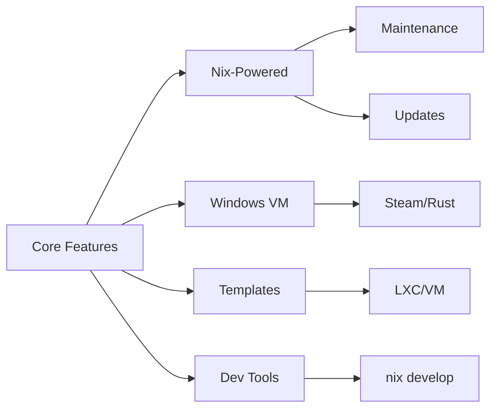
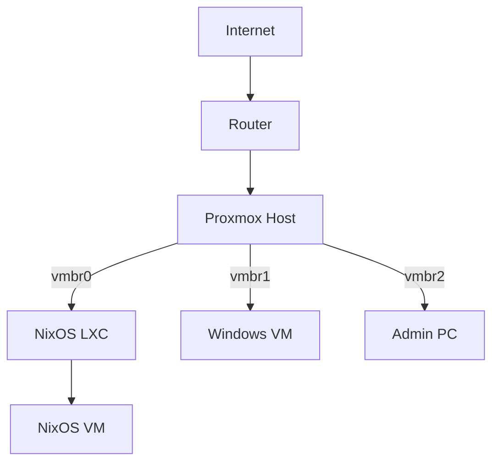
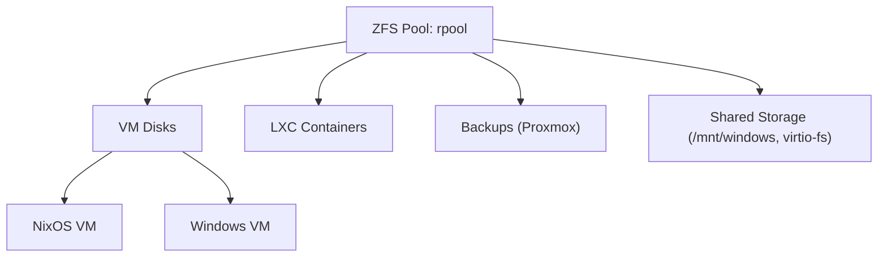
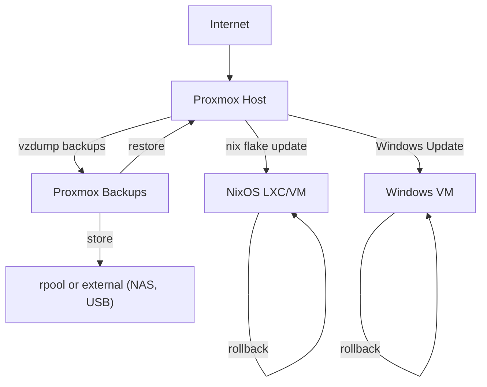
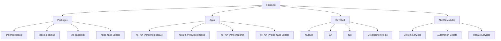
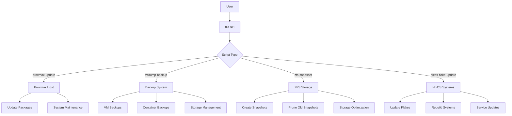
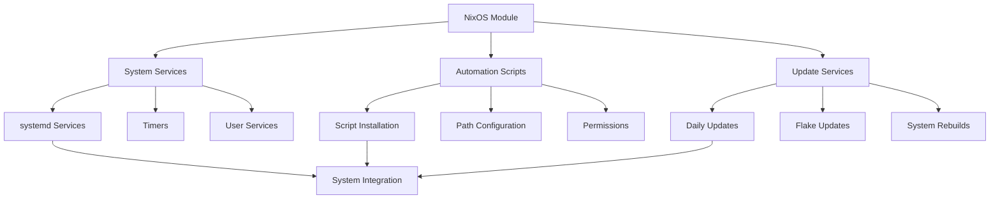
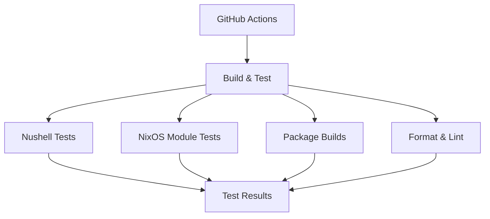

# Architecture Overview

This document provides a high-level overview of the architecture, network topology, storage layout, update and backup flow, and hardware for the Proxmox + NixOS + Windows setup. For usage and configuration details, see the [USAGE.md](./USAGE.md).

## Table of Contents

- [Core Components](#core-components)
- [System Architecture](#system-architecture)
  - [Network Topology](#network-topology)
  - [Storage Layout](#storage-layout)
  - [Update & Backup Flow](#update--backup-flow)
- [Hardware & Configuration](#hardware--configuration)
  - [Hardware Example](#hardware-example)
  - [PCI Passthrough](#pci-passthrough)
- [Nix Integration](#nix-integration)
  - [Flake Structure](#flake-structure)
  - [Automation Flow](#automation-flow)
  - [Module Integration](#module-integration)
- [Testing Infrastructure](#testing-infrastructure)

## Core Components

## System Architecture

### Network Topology

> **Note:** Diagrams use [Mermaid](https://mermaid-js.github.io/) syntax. Rendered diagrams require a compatible Markdown viewer (e.g., GitHub, VS Code, Obsidian).

### Storage Layout

### Update & Backup Flow

## Hardware & Configuration

### Hardware Example

> **Note:** The following hardware is a personal example. Adapt these specs to your own needs and available hardware.

| Component      | Model/Details                                  |
|----------------|------------------------------------------------|
| **CPU**        | AMD Ryzen 5950X (16c/32t, virtualization OK)   |
| **RAM**        | 128GB ECC DDR4                                 |
| **Storage**    | 2x2TB NVMe (ZFS mirror), 4x8TB HDD (ZFS RAIDZ1) |
| **GPU**        | NVIDIA RTX 3060 (Windows passthrough)          |
| **Network**    | 2x 2.5GbE (Intel i225-V)                       |
| **Proxmox**    | 8.1                                            |

The host is configured with:

- NixOS LXC (for services, immutable)
- NixOS VM (for atomic updates)
- Windows VM (for GPU passthrough, apps)

### PCI Passthrough

Example PCI devices passed through to VMs:

- GPU: 01:00.0, 01:00.1 (audio)
- USB controller: 03:00.0

For more details, see the [Windows on Proxmox Guide](./docs/guides/windows-on-proxmox.md).

## Nix Integration

### Flake Structure

### Automation Flow

### Module Integration

## Testing Infrastructure

### Test Components

1. **Nushell Tests** (`tests/`)
   - Unit tests (`unit-tests.nu`)
   - Integration tests (`integration-tests.nu`)
   - Performance tests (`performance-tests.nu`)
   - Test utilities (`test-utils.nu`)

2. **NixOS Module Tests**
   - Module integration
   - Configuration validation
   - Service verification
   - Dependency checks

3. **Build Verification**
   - Multi-architecture builds
   - Package verification
   - Flake compatibility

4. **Code Quality**
   - Nushell formatting/linting
   - Nix code formatting
   - Documentation validation

For more details on testing, see the [Testing Guide](./docs/testing.md).
