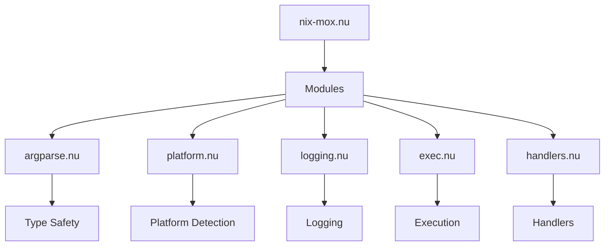
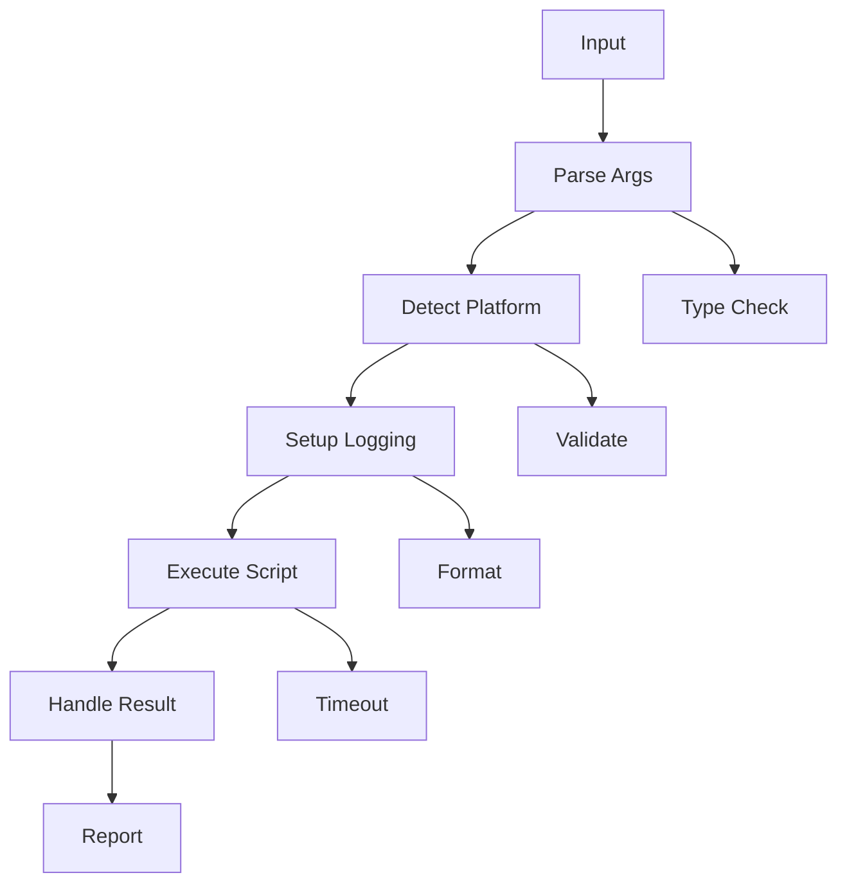
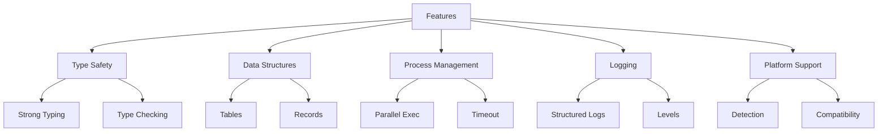
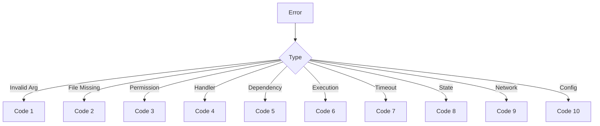
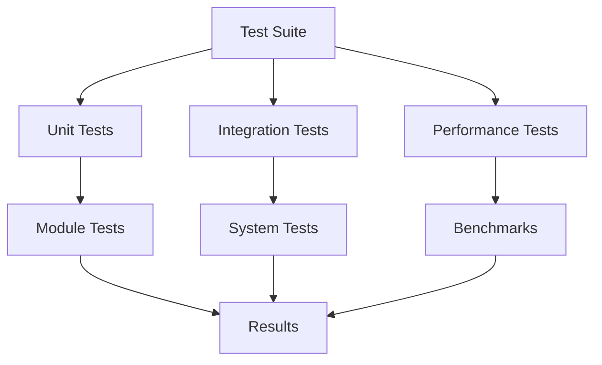
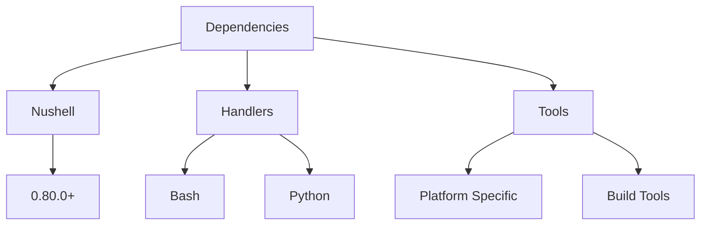
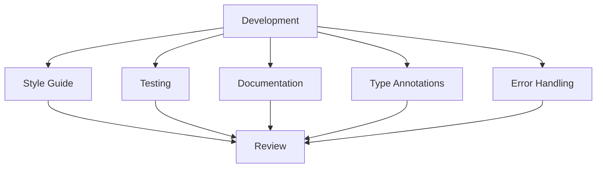

# Nushell Implementation

Terse guide for nix-mox's Nushell implementation, providing robust and type-safe automation.

## Architecture



## Module Flow



## Features



## Usage Examples

```nushell
# Basic
./scripts/nix-mox.nu
./scripts/nix-mox.nu --platform linux
./scripts/nix-mox.nu --verbose

# Advanced
./scripts/nix-mox.nu --timeout 30
./scripts/nix-mox.nu --retry 3 --retry-delay 5
./scripts/nix-mox.nu --parallel
./scripts/nix-mox.nu --log-file install.log
```

## Error Handling



## Testing Flow



## Module Examples

### Argument Parsing

```nushell
# argparse.nu
let config = parse_args ["--platform", "linux", "--script", "install"]
```

### Platform Detection

```nushell
# platform.nu
let platform = detect_platform
let script = get_platform_script $platform "install"
```

### Logging

```nushell
# logging.nu
log "INFO" "Operation completed"
handle_error $env.ERROR_CODES.INVALID_ARGUMENT "Invalid input"
```

### Execution

```nushell
# exec.nu
run_script "scripts/install.sh" --verbose
run_with_retry "scripts/install.sh" --force
```

### Handlers

```nushell
# handlers.nu
handle_script "scripts/install.sh" --platform linux
run_platform_script "linux" "install"
```

## Dependencies



## Development Flow


