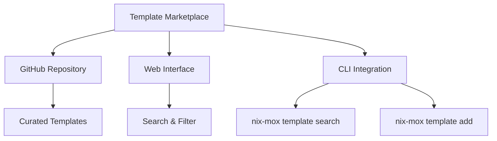
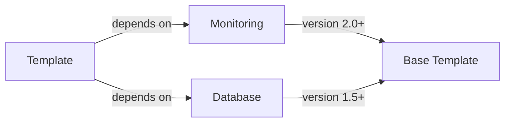
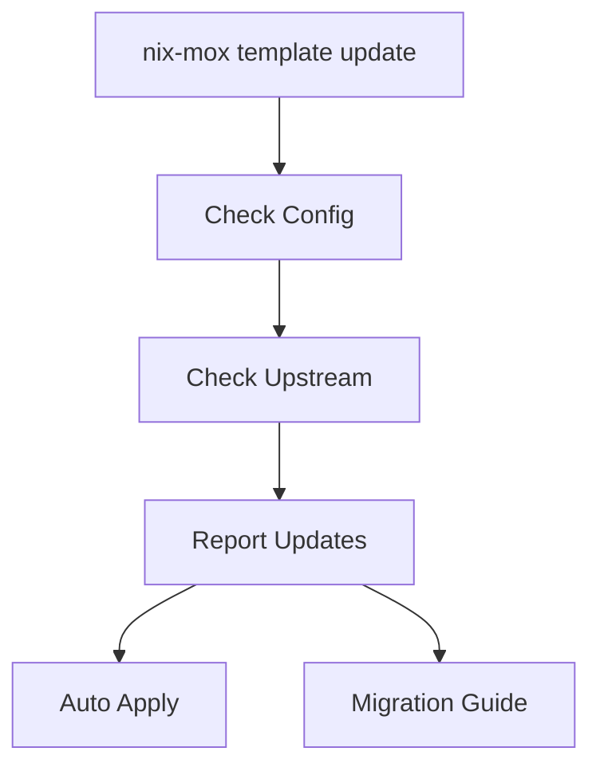
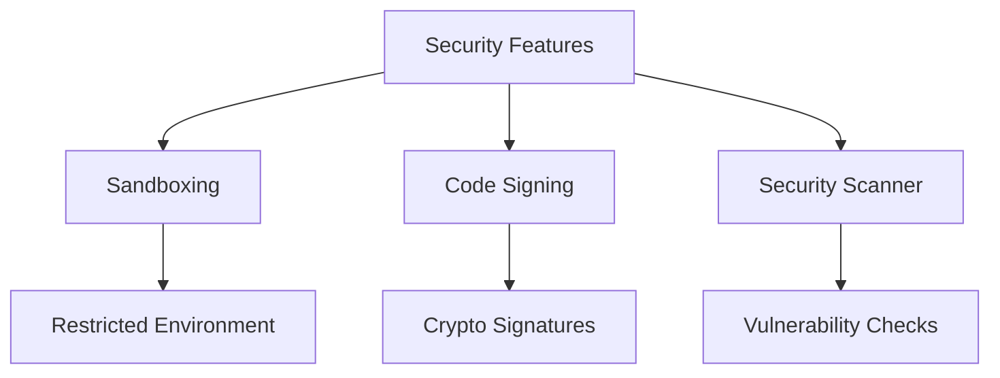
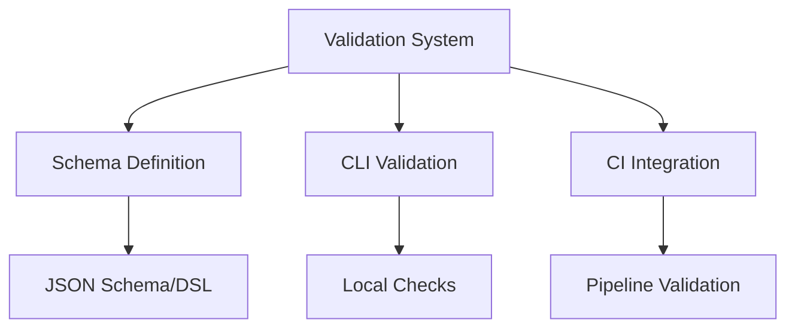
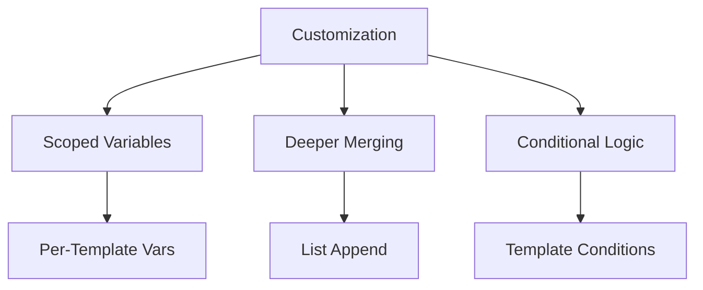

# Future Development Roadmap

This document outlines the next steps for evolving `nix-mox` into a more powerful and user-friendly platform.

## 1. Template Marketplace

- **Core Concept**: Centralized hub for template discovery and sharing
- **Key Features**:
  - Curated GitHub repository
  - Searchable web interface
  - CLI integration (`nix-mox template search/add`)
- **Benefits**: Community growth, faster development, standardized practices

## 2. Advanced Template Dependencies

- **Core Concept**: Formal dependency management system
- **Implementation**:
  - `templateDependencies` attribute
  - Recursive dependency resolution
  - Version constraints support
- **Benefits**: Better modularity, explicit relationships, error prevention

## 3. Automated Template Updates

- **Core Concept**: Streamlined update process
- **Features**:
  - Automatic version checking
  - Non-breaking change updates
  - Migration guides
- **Benefits**: Easier maintenance, security updates, best practices

## 4. Enhanced Template Security

- **Core Concept**: Security-first template ecosystem
- **Features**:
  - Template sandboxing
  - Cryptographic signing
  - Automated security scanning
- **Benefits**: Trust building, supply chain security, secure defaults

## 5. Rich Template Validation

- **Core Concept**: Robust template validation
- **Features**:
  - Formal schema definition
  - CLI validation tool
  - CI pipeline integration
- **Benefits**: Early error detection, consistent quality, better UX

## 6. Enhanced Customization

- **Core Concept**: Extended customization capabilities
- **Features**:
  - Template-scoped variables
  - Advanced merging strategies
  - Conditional template logic
- **Benefits**: More flexible templates, better control, cleaner code
