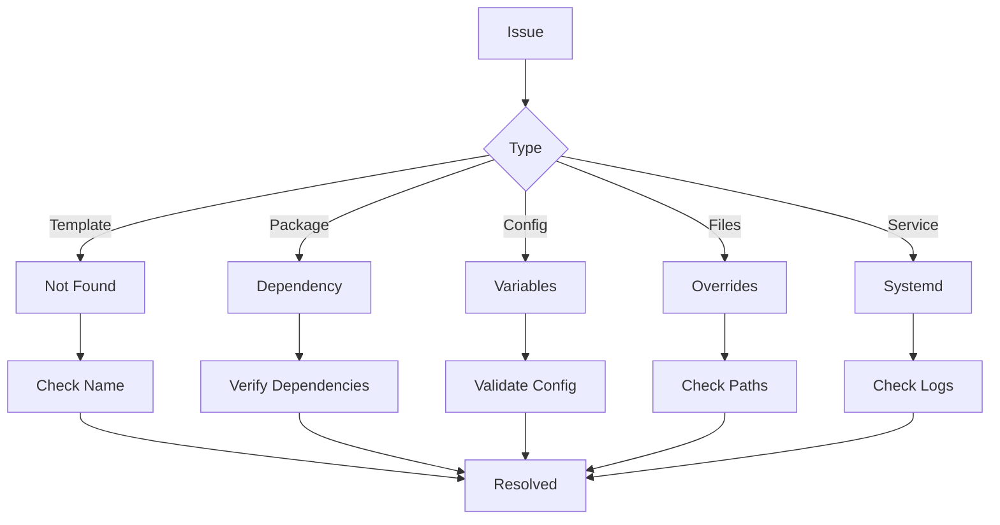
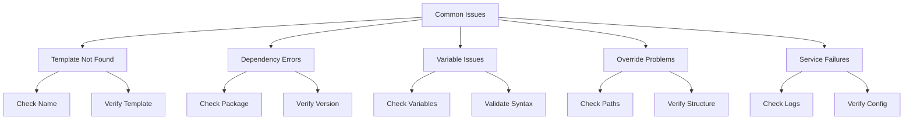
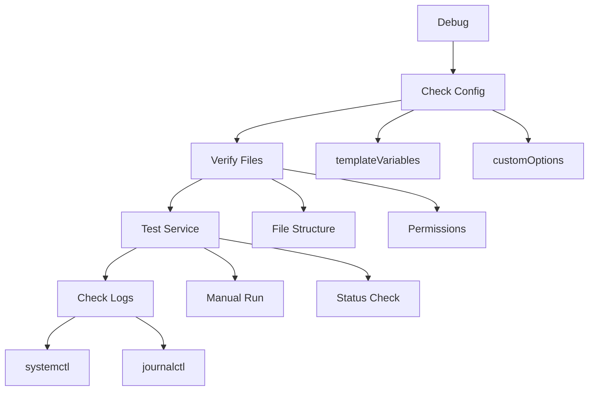
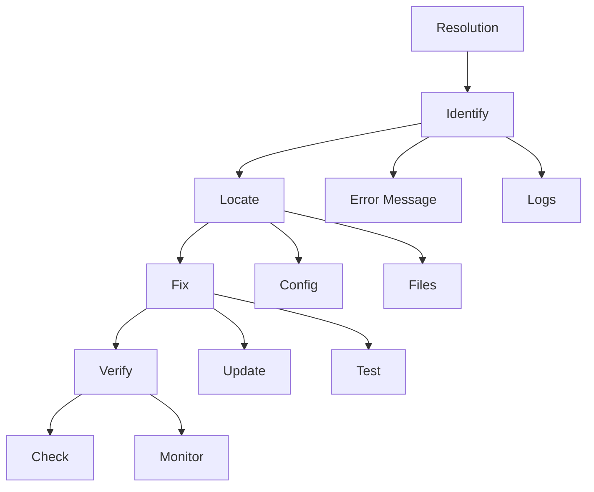

# Troubleshooting Guide

Terse guide for resolving common issues with `nix-mox` templates.

## Issue Resolution Flow



## Common Issues



## Quick Solutions

### 1. Template Not Found

```nix
# Error: 'template-name' not in enumeration
services.nix-mox.templates.templates = [
  "template-name"  # Check spelling
];
```

### 2. Dependency Errors

```nix
# Error: Dependency 'some-package' not found
services.nix-mox.templates.customOptions = {
  template-name = {
    package = "some-package";  # Verify in pkgs
  };
};
```

### 3. Variable Substitution

```nix
# Error: @variable@ not replaced
services.nix-mox.templates.templateVariables = {
  variable = "value";  # Match exactly
};
```

### 4. Override Issues

```nix
# Error: Override not applied
services.nix-mox.templates.templateOverrides = {
  "template-name" = ./path;  # Verify structure
};
```

### 5. Service Failures

```bash
# Check service status
systemctl status <service-name>.service
journalctl -u <service-name>.service
```

## Debug Flow



## Resolution Steps


