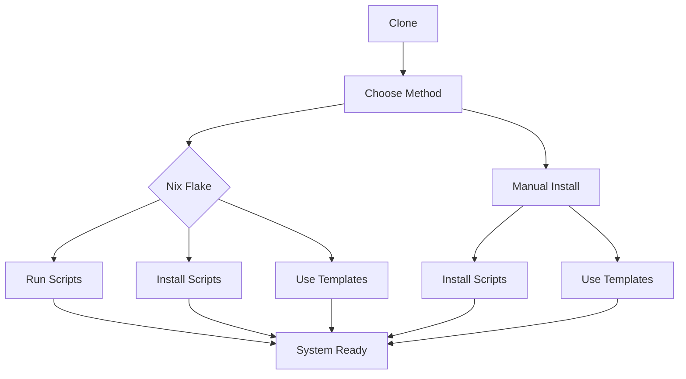
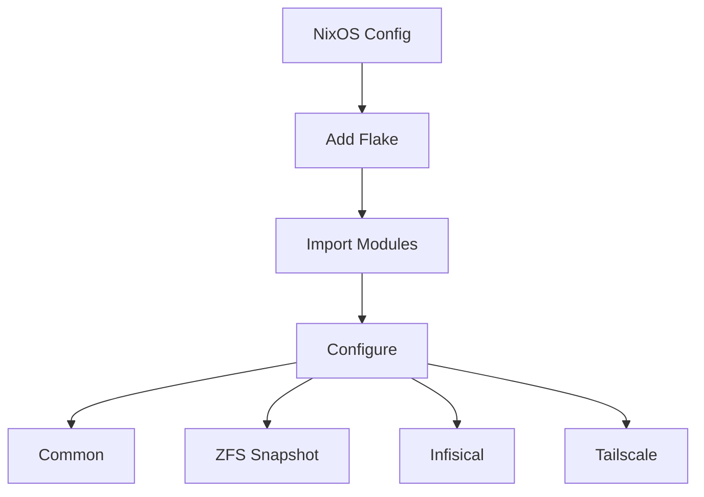
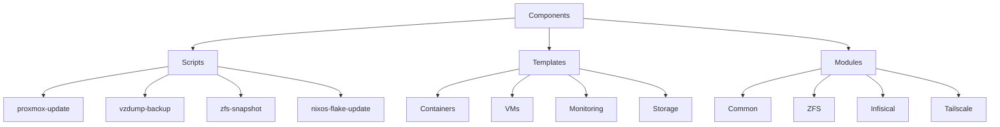
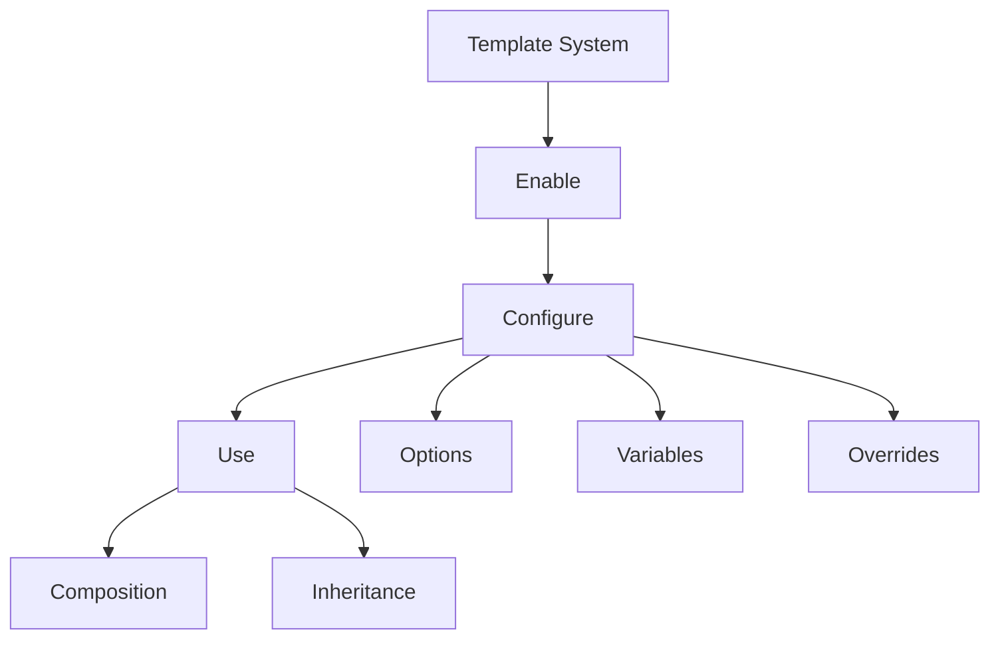
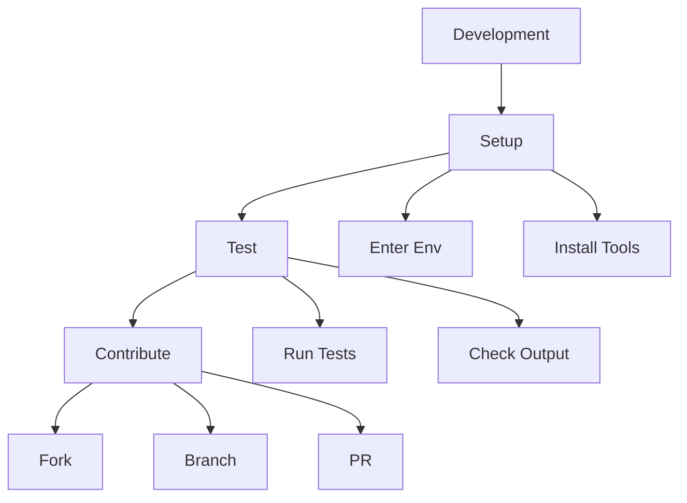
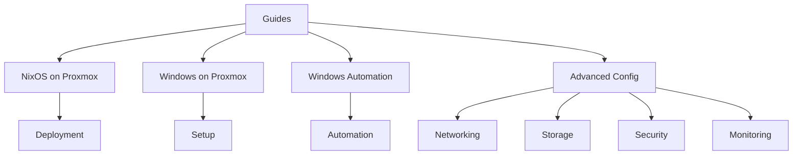
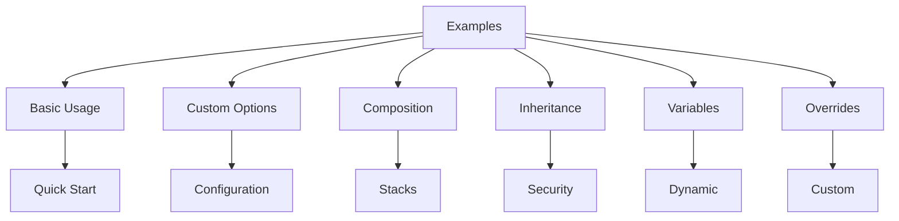

# Usage & Deployment Guide

Terse guide for deploying and using nix-mox automation scripts and infrastructure templates.

## Deployment Flow



## Quick Start

### 1. Clone

```bash
git clone https://github.com/hydepwns/nix-mox.git
cd nix-mox
```

### 2. Nix Flake (Recommended)

```bash
# Run scripts
nix run .#proxmox-update
nix run .#zfs-snapshot
nix run .#nixos-flake-update

# Install scripts
nix profile install .#proxmox-update
```

### 3. Manual Install (Legacy)

```bash
sudo nu scripts/linux/install.nu
```

## Module Integration



### Module Configuration

```nix
# flake.nix
{
  inputs.nix-mox.url = "github:hydepwns/nix-mox";
}

# configuration.nix
{
  imports = [
    nix-mox.nixosModules.nix-mox
    nix-mox.nixosModules.zfs-auto-snapshot
    nix-mox.nixosModules.infisical
    nix-mox.nixosModules.tailscale
  ];
}
```

## Available Components



## Template System



### Template Configuration

```nix
services.nix-mox.templates = {
  enable = true;
  templates = [ "web-server" "database-management" ];
  customOptions = {
    web-server = {
      serverType = "nginx";
      enableSSL = true;
    };
  };
  templateVariables = {
    admin_user = "site-admin";
    domain = "example.com";
  };
};
```

## Development Flow



### Development Commands

```bash
# Enter environment
nix develop

# Run tests
nu scripts/run-tests.nu
nu scripts/run-tests.nu --verbose
nu scripts/run-tests.nu --module unit-tests

# Contribute
git checkout -b feature/your-feature
git commit -m "feat: your feature"
git push origin feature/your-feature
```

## Guides & References



## Examples

The `nixamples` directory contains comprehensive examples to help you get started:



### Example Categories

1. **Basic Usage** (`01-basic-usage/`)
   - Simple template deployment
   - Basic configuration
   - Quick start guide

2. **Custom Options** (`02-custom-options/`)
   - Environment-specific settings
   - Multi-site configurations
   - Advanced features

3. **Template Composition** (`03-composition/`)
   - Web application stacks
   - Database configurations
   - Monitoring setups

4. **Template Inheritance** (`04-inheritance/`)
   - Security templates
   - Base configurations
   - Feature extensions

5. **Template Variables** (`05-variables/`)
   - Dynamic configurations
   - Environment variables
   - Secret management

6. **Template Overrides** (`06-overrides/`)
   - Custom configurations
   - File replacements
   - Conditional overrides

Each example includes:

- Visual diagrams
- Configuration snippets
- Practical use cases
- Verification steps
- Troubleshooting guides

## Development

```bash
# Enter development environment
nix develop

# Run tests
nu scripts/run-tests.nu

# Run specific test
nu scripts/run-tests.nu --test "test-name"
```

## Configuration

See [ARCHITECTURE.md](./ARCHITECTURE.md) for detailed configuration options.
