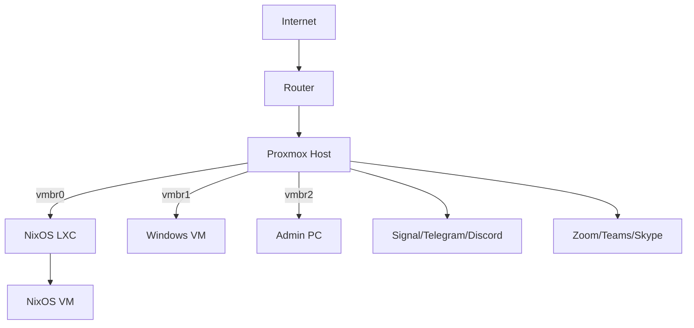
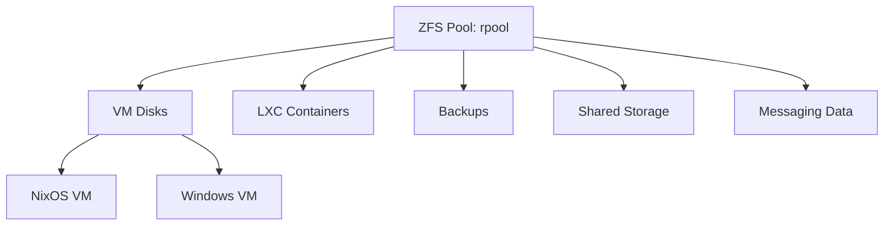
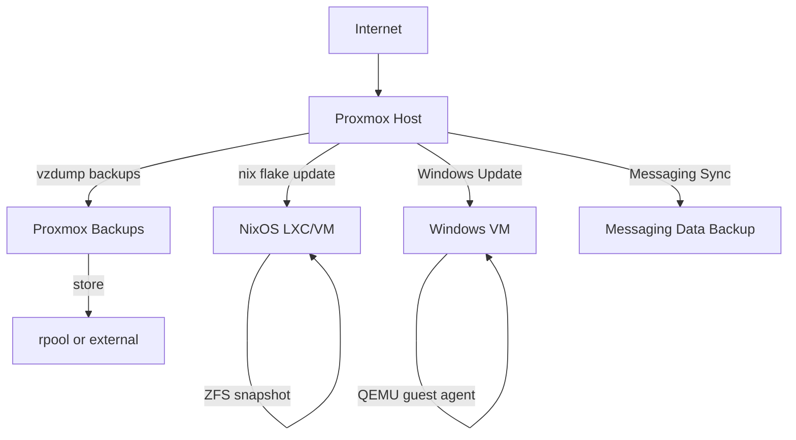
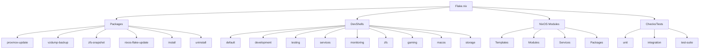
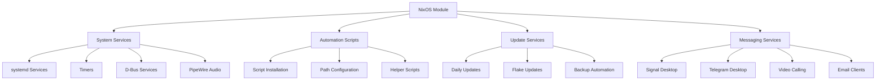
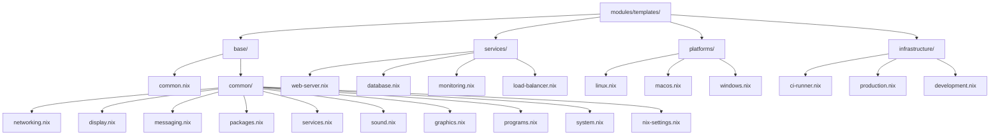
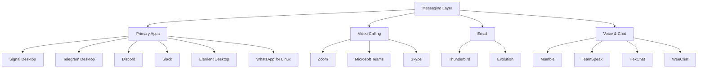
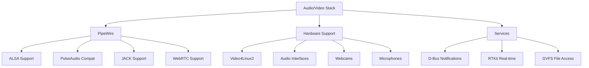

# Architecture Overview

High-level overview of the nix-mox configuration framework architecture - a comprehensive NixOS configuration system with development tools, monitoring, system management utilities, and messaging support.

## Core Components

### Development & Management

- **Nix-Powered Maintenance & Updates**: Automated system updates and maintenance
- **Development Shells**: Multiple specialized development environments
- **Testing Infrastructure**: Comprehensive unit and integration testing
- **Package Management**: Curated package collections and utilities

### System Management

- **Proxmox Integration**: VM/LXC management and backup utilities
- **ZFS Storage Management**: Snapshot and storage utilities
- **Service Management**: Systemd services and automation
- **Security & Monitoring**: System security and monitoring tools

### Communication & Productivity

- **Messaging & Communication Suite**: Complete messaging platform integration
  - Primary: Signal Desktop, Telegram Desktop, Discord, Slack
  - Video Calling: Zoom, Microsoft Teams, Skype
  - Email: Thunderbird, Evolution
  - Voice & Chat: Mumble, TeamSpeak, IRC clients
- **Productivity Tools**: Communication and collaboration applications

### Gaming & Entertainment

- **Linux Gaming Shell**: Steam, Wine, Lutris, MangoHud, GameMode, DXVK, VKD3D
- **Windows Gaming Support**: League of Legends and other Windows games via Wine/Lutris
- **Helper Scripts**: Wine configuration and game setup automation

### Platform Support

- **Linux Development**: Core development tools and system utilities
- **macOS Development Shell**: macOS-specific frameworks and development tools
- **Cross-Platform Support**: Unified configuration across Linux, macOS, and Windows

## System Architecture

### Network Topology

### Storage Layout

### Update & Backup Flow

## Hardware & Configuration

### Hardware Example

| Component      | Model/Details                                  |
|----------------|------------------------------------------------|
| **CPU**        | AMD Ryzen 5950X (16c/32t)                      |
| **RAM**        | 128GB ECC DDR4                                 |
| **Storage**    | 2x2TB NVMe (ZFS mirror), 4x8TB HDD (ZFS RAIDZ1) |
| **GPU**        | NVIDIA RTX 3060 (Windows passthrough)          |
| **Network**    | 2x 2.5GbE (Intel i225-V)                       |
| **Audio/Video**| Webcam, Microphone, Audio Interface            |

### PCI Passthrough

- GPU: 01:00.0, 01:00.1 (audio)
- USB controller: 03:00.0

## Nix Integration

### Flake Structure

### Module Integration

### Template System

## Messaging & Communication Architecture

### Messaging Stack

### Audio/Video Infrastructure

## Testing Infrastructure

The testing infrastructure is organized under `scripts/tests/` and includes:

- **Unit Tests** (`scripts/tests/unit/`): Individual component testing
- **Integration Tests** (`scripts/tests/integration/`): End-to-end system testing
- **Performance Tests** (`scripts/tests/integration/performance-tests.nu`): System performance validation
- **Test Utilities** (`scripts/tests/lib/`): Common testing functions and helpers
  - `test-utils.nu`: Core test utilities and environment management
  - `test-coverage.nu`: Coverage reporting and aggregation
  - `coverage-core.nu`: Coverage tracking and data collection
  - `shared.nu`: Shared test functions
  - `test-common.nu`: Common test functions

Test execution is managed through multiple methods:

- **Make Commands**: `make test`, `make unit`, `make integration`, `make clean`
- **Nix Flake Checks**: `nix flake check`, granular test execution via flake outputs
- **Direct Nushell**: `nu -c "source scripts/tests/run-tests.nu; run []"`
- **Main Runner**: `scripts/tests/run-tests.nu`: Comprehensive test orchestration

The testing system provides:

- **Coverage Reporting**: Automatic coverage generation in `TEST_TEMP_DIR`
- **Cross-platform Support**: Tests run on Linux, macOS, and Windows
- **Sandbox Compatibility**: Works in Nix build environments
- **CI/CD Integration**: GitHub Actions support via `nix flake check`

For more details, see the [Testing Guide](./../guides/testing.md).

## Package Collections

### Productivity Packages

```mermaid
graph TD
    A[Productivity] --> B[Communication]
    A --> C[Development]
    A --> D[System]
    A --> E[Multimedia]
    
    B --> B1[Signal Desktop]
    B --> B2[Telegram Desktop]
    B --> B3[Discord]
    B --> B4[Slack]
    B --> B5[Element Desktop]
    B --> B6[WhatsApp for Linux]
    B --> B7[Zoom]
    B --> B8[Teams]
    B --> B9[Skype]
    B --> B10[Thunderbird]
    B --> B11[Evolution]
    B --> B12[Mumble]
    B --> B13[TeamSpeak]
    B --> B14[HexChat]
    B --> B15[WeeChat]
    
    C --> C1[Development Tools]
    C --> C2[Error Handling]
    
    D --> D1[System Utilities]
    D --> D2[Linux Packages]
    D --> D3[Windows Packages]
    
    E --> E1[Multimedia Tools]
```

## Security & Monitoring

### Security Components

- **Infisical Integration**: Secrets management and configuration
- **Tailscale VPN**: Secure network connectivity
- **System Hardening**: Security-focused configurations
- **Access Control**: User and permission management

### Monitoring Stack

- **System Monitoring**: Performance and resource tracking
- **Service Monitoring**: Application and service health checks
- **Log Management**: Centralized logging and analysis
- **Alerting**: Notification systems for system events

## Deployment & Configuration

### Configuration Templates

- **Safe Configuration**: Complete desktop setup with display safety and messaging support
- **CI Runner**: High-performance CI/CD environment
- **Web Server**: Production web server configuration
- **Database**: Database server setup
- **Monitoring**: Prometheus/Grafana monitoring stack
- **Load Balancer**: HAProxy configuration

### Fragment System

The fragment system allows modular configuration composition:

- **Base Fragments**: Core system components (networking, display, messaging, packages)
- **Service Fragments**: Individual service configurations
- **Platform Fragments**: Platform-specific configurations
- **Infrastructure Fragments**: Infrastructure and deployment configurations

### Cross-Platform Support

- **Linux**: Full NixOS integration with all features
- **macOS**: Development tools and macOS-specific frameworks
- **Windows**: Limited support through WSL and development tools
- **Proxmox**: Complete virtualization and container management

For detailed usage instructions, see the [Usage Guide](./../USAGE.md) and [Examples](./../nixamples/).
