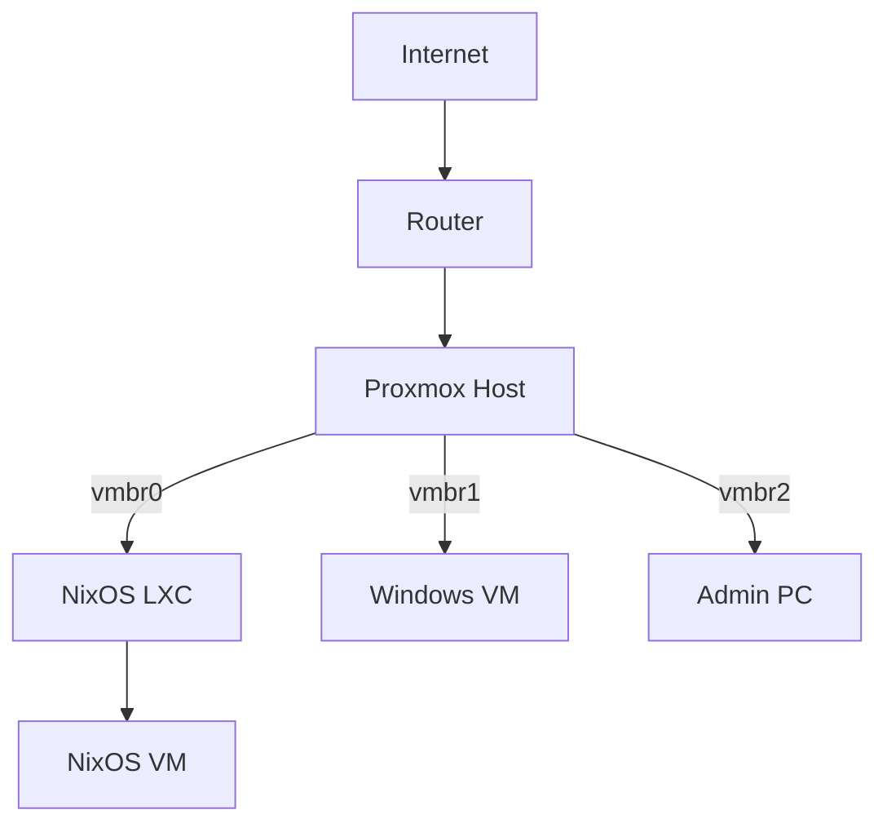
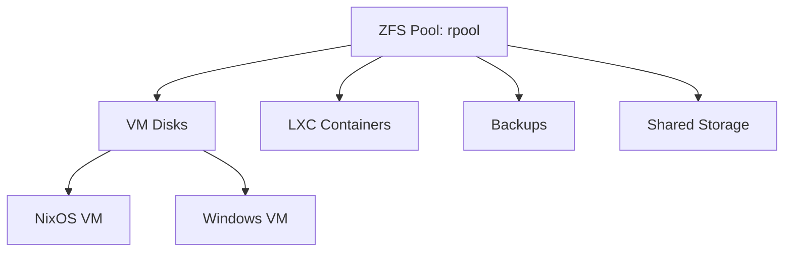
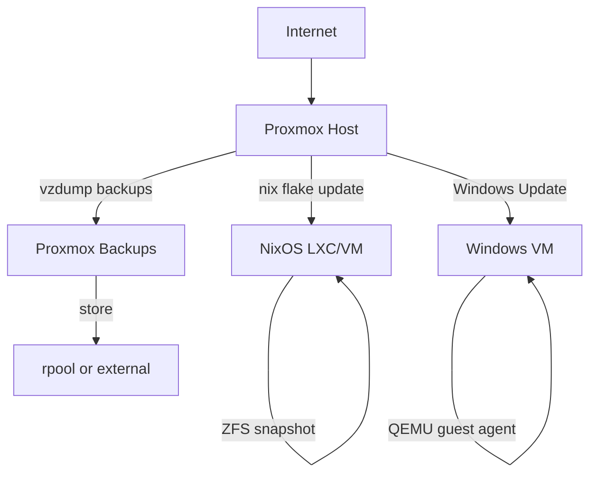
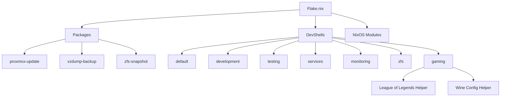
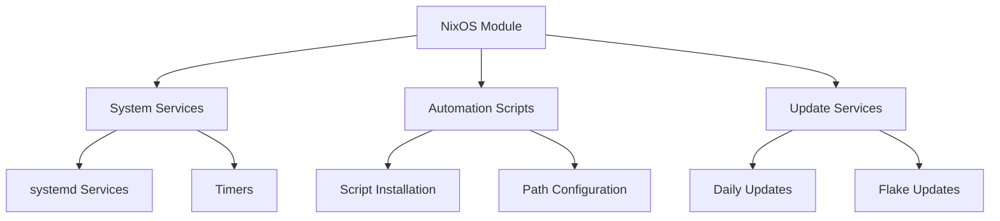

# Architecture Overview

High-level overview of the Proxmox + NixOS + Windows setup architecture.

## Core Components

- Nix-Powered Maintenance & Updates
- Windows VM with Steam/Rust
- LXC/VM Templates
- Development Tools
- **Linux & Windows Gaming Shell**
  - Gaming shell with Steam, Wine, Lutris, MangoHud, GameMode, DXVK, VKD3D
  - Helper scripts for Wine and League of Legends setup
  - League of Legends and other Windows games via Wine/Lutris

## System Architecture

### Network Topology

### Storage Layout

### Update & Backup Flow

## Hardware & Configuration

### Hardware Example

| Component      | Model/Details                                  |
|----------------|------------------------------------------------|
| **CPU**        | AMD Ryzen 5950X (16c/32t)                      |
| **RAM**        | 128GB ECC DDR4                                 |
| **Storage**    | 2x2TB NVMe (ZFS mirror), 4x8TB HDD (ZFS RAIDZ1) |
| **GPU**        | NVIDIA RTX 3060 (Windows passthrough)          |
| **Network**    | 2x 2.5GbE (Intel i225-V)                       |

### PCI Passthrough

- GPU: 01:00.0, 01:00.1 (audio)
- USB controller: 03:00.0

## Nix Integration

### Flake Structure

### Module Integration

## Testing Infrastructure

The testing infrastructure is organized under `modules/scripts/testing/` and includes:

- **Unit Tests** (`unit/`): Individual component testing
- **Integration Tests** (`integration/`): End-to-end system testing
- **Performance Tests** (`integration/performance-tests.nu`): System performance validation
- **Test Fixtures** (`fixtures/`): Test data and mock configurations
- **Test Utilities** (`lib/`): Common testing functions and helpers
- **Storage Tests** (`storage/`): ZFS and storage-specific tests

Test execution is managed through:

- `run-tests.nu`: Main test runner
- `summarize-tests.sh`: Test results aggregation and reporting

For more details, see the [Testing Guide](./docs/testing.md).
