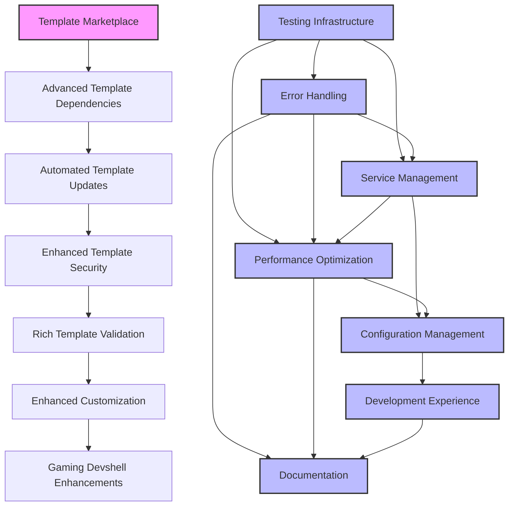

# Future Development Roadmap

## Dependency Graph

## 1. Template Marketplace

- Centralized hub for template discovery
- GitHub repository integration
- Web interface for search
- CLI tools for template management

## 2. Advanced Template Dependencies

- Formal dependency management
- Version constraints
- Recursive dependency resolution
- Explicit relationships

## 3. Automated Template Updates

- Automatic version checking
- Non-breaking change updates
- Migration guides
- Update notifications

## 4. Enhanced Template Security

- Template sandboxing
- Cryptographic signing
- Security scanning
- Supply chain security

## 5. Rich Template Validation

- Schema validation
- CLI validation tools
- CI pipeline integration
- Quality checks

## 6. Enhanced Customization

- Template-scoped variables
- Advanced merging strategies
- Conditional logic
- Flexible configuration

## 7. Gaming Devshell Enhancements

- Integration with Steam, Wine, and Lutris
- Performance optimization tools
- Game-specific configurations
- Automated game updates

## 8. Comprehensive Testing Infrastructure
>
> Related to: [Service Management](#11-service-management-enhancements), [Performance Optimization](#13-performance-optimization), [Error Handling](#9-enhanced-error-handling-and-logging)

- Integration test framework
  - End-to-end testing for template deployments
  - Service interaction testing
  - Network configuration testing
  - Cross-platform compatibility testing
- Performance benchmarking suite
  - Resource usage metrics
  - Response time measurements
  - Scalability testing
  - Load testing scenarios
- Security testing automation
  - Vulnerability scanning
  - Penetration testing
  - Security compliance checks
  - Dependency security audits
- Regression testing pipeline
  - Automated test runs
  - Test result reporting
  - Failure analysis tools
  - Test environment management
- Test coverage reporting
  - Code coverage metrics
  - Template coverage tracking
  - Configuration coverage
  - Documentation coverage
- CI/CD integration
  - GitHub Actions workflows
  - GitLab CI pipelines
  - Jenkins integration
  - Automated deployment testing

## 9. Enhanced Error Handling and Logging
>
> Related to: [Testing Infrastructure](#8-comprehensive-testing-infrastructure), [Service Management](#11-service-management-enhancements), [Performance Optimization](#13-performance-optimization)

- Structured logging system
  - JSON log format
  - Log level management
  - Contextual logging
  - Log rotation policies
- Centralized error tracking
  - Error aggregation
  - Error categorization
  - Error pattern detection
  - Error resolution tracking
- Log aggregation and analysis
  - ELK stack integration
  - Log parsing tools
  - Log visualization
  - Log search capabilities
- Custom log formatters
  - Template-specific formatters
  - Environment-specific formats
  - Custom log fields
  - Log filtering options
- Log retention policies
  - Automated cleanup
  - Archive management
  - Compliance requirements
  - Storage optimization
- Error reporting dashboard
  - Real-time error monitoring
  - Error statistics
  - Alert configuration
  - Error resolution tracking

## 10. Development Experience Improvements
>
> Related to: [Documentation](#14-documentation-and-support), [Testing Infrastructure](#8-comprehensive-testing-infrastructure), [Configuration Management](#12-configuration-management)

- Development container templates
  - VS Code integration
  - JetBrains IDE support
  - Custom development environments
  - Toolchain management
- Automated code formatting
  - Nix code formatter
  - Shell script formatting
  - Documentation formatting
  - Style guide enforcement
- Pre-commit hooks
  - Code quality checks
  - Test execution
  - Documentation validation
  - Security scanning
- Code quality checks
  - Static analysis
  - Complexity metrics
  - Code smell detection
  - Best practice enforcement
- IDE integration
  - Syntax highlighting
  - Code completion
  - Error detection
  - Debugging support
- Documentation generation
  - API documentation
  - Usage examples
  - Configuration reference
  - Architecture diagrams

## 11. Service Management Enhancements
>
> Related to: [Testing Infrastructure](#8-comprehensive-testing-infrastructure), [Error Handling](#9-enhanced-error-handling-and-logging), [Performance Optimization](#13-performance-optimization)

- Service discovery integration
  - DNS-based discovery
  - Service registry
  - Health check integration
  - Load balancing support
- Health check framework
  - Custom health checks
  - Dependency checking
  - Resource monitoring
  - Alert configuration
- Service dependency management
  - Dependency graphs
  - Version constraints
  - Update management
  - Conflict resolution
- Service scaling automation
  - Auto-scaling rules
  - Resource allocation
  - Load balancing
  - Performance optimization
- Service monitoring templates
  - Prometheus integration
  - Grafana dashboards
  - Alert rules
  - Metric collection
- Service backup strategies
  - Automated backups
  - Backup verification
  - Restore procedures
  - Retention policies

## 12. Configuration Management
>
> Related to: [Service Management](#11-service-management-enhancements), [Development Experience](#10-development-experience-improvements), [Error Handling](#9-enhanced-error-handling-and-logging)

- Configuration validation framework
  - Schema validation
  - Type checking
  - Dependency validation
  - Environment validation
- Migration tooling
  - Version migration
  - Configuration conversion
  - Rollback support
  - Migration testing
- Backup and restore functionality
  - Automated backups
  - Incremental backups
  - Point-in-time recovery
  - Backup verification
- Configuration versioning
  - Version control integration
  - Change tracking
  - Rollback support
  - Version comparison
- Environment-specific configs
  - Development configs
  - Staging configs
  - Production configs
  - Testing configs
- Secret management
  - Encryption at rest
  - Secure distribution
  - Access control
  - Audit logging

## 13. Performance Optimization
>
> Related to: [Service Management](#11-service-management-enhancements), [Testing Infrastructure](#8-comprehensive-testing-infrastructure), [Error Handling](#9-enhanced-error-handling-and-logging)

- Configuration caching
  - In-memory caching
  - Disk caching
  - Cache invalidation
  - Cache statistics
- Parallel processing support
  - Task parallelization
  - Resource management
  - Load balancing
  - Error handling
- Resource usage optimization
  - Memory optimization
  - CPU optimization
  - Disk I/O optimization
  - Network optimization
- Load testing tools
  - Stress testing
  - Endurance testing
  - Spike testing
  - Scalability testing
- Performance monitoring
  - Real-time metrics
  - Resource usage
  - Response times
  - Error rates
- Optimization recommendations
  - Automated suggestions
  - Performance reports
  - Bottleneck detection
  - Improvement tracking

## 14. Documentation and Support
>
> Related to: [Development Experience](#10-development-experience-improvements), [Testing Infrastructure](#8-comprehensive-testing-infrastructure), [Error Handling](#9-enhanced-error-handling-and-logging)

- API documentation generator
  - OpenAPI/Swagger support
  - Code examples
  - Parameter documentation
  - Response schemas
- Example use cases
  - Common scenarios
  - Best practices
  - Troubleshooting guides
  - Performance tips
- Troubleshooting guides
  - Common issues
  - Debug procedures
  - Error messages
  - Resolution steps
- Contribution guidelines
  - Code style guide
  - Pull request process
  - Testing requirements
  - Documentation standards
- Community documentation
  - User guides
  - Tutorials
  - FAQs
  - Community resources
- Support ticket system
  - Issue tracking
  - Feature requests
  - Bug reports
  - Support workflow
