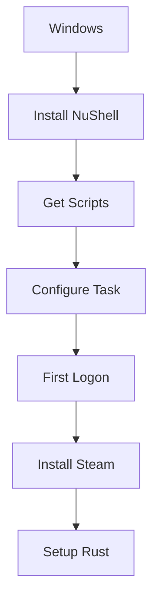
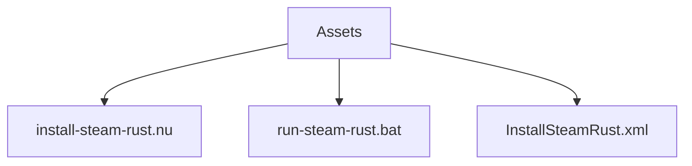
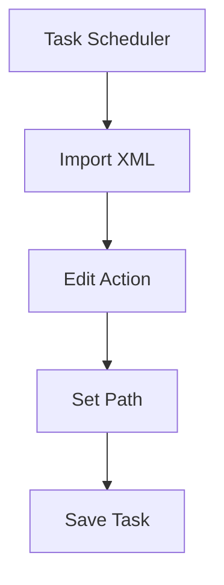
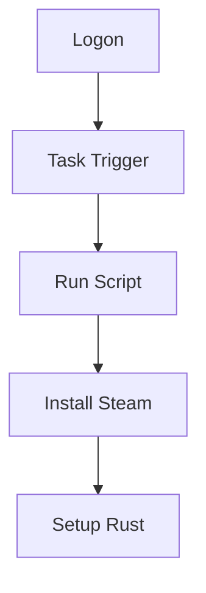
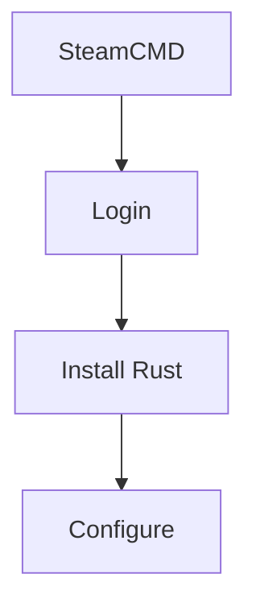
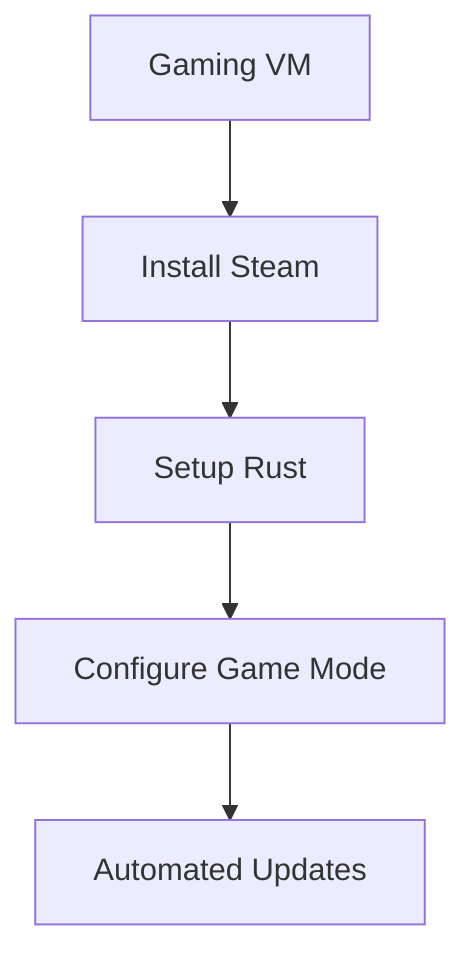

# Windows Automation Guide

## Automation Flow



## Script Components



## Quick Setup

1. **Get Scripts**

   ```bash
   nix build .#windows-automation-assets-sources
   cp result/* C:/nix-mox-scripts/
   ```

2. **Install NuShell**

   ```powershell
   choco install nushell -y
   nu --version
   ```

3. **Configure Task**

   ```batch
   nu "%~dp0install-steam-rust.nu" %*
   ```

4. **Register Task**

   ```powershell
   schtasks /create /tn InstallSteamRust /xml InstallSteamRust.xml
   ```

## Task Configuration



## First Logon Process



## Optional: Self-Destruct Task

```nu
log_info "Deleting scheduled task"
try {
    run-external "schtasks.exe" "/Delete" "/TN" "InstallSteamRust" "/F"
    log_success "Task deleted"
} catch {
    log_warn "Could not delete task"
}
```

## Optional: Headless Install



For full headless installation details, see comments in `../scripts/windows/install-steam-rust.nu`.

## Gaming Automation



### Game Mode Configuration

```powershell
# Enable Game Mode
reg add "HKLM\SOFTWARE\Microsoft\GameBar" /v "AllowAutoGameMode" /t REG_DWORD /d 1 /f

# Disable Fullscreen Optimizations
reg add "HKLM\SOFTWARE\Microsoft\Windows NT\CurrentVersion\AppCompatFlags\Layers" /v "C:\Program Files (x86)\Steam\steamapps\common\Rust\RustClient.exe" /t REG_SZ /d "~ DISABLEDXMAXIMIZEDWINDOWEDMODE" /f
```
