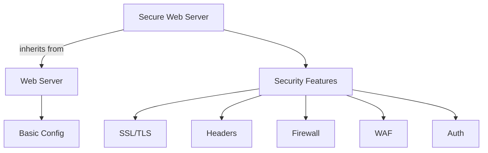

# Template Inheritance

Extend base templates with additional features using inheritance.



## Configuration

```nix
# configuration.nix
{
  services.nix-mox.templates = {
    enable = true;
    templates = [ "secure-web-server" ];
    customOptions = {
      web-server = {
        serverType = "nginx";
        virtualHosts = [{
          name = "secure-site";
          domain = "secure.example.com";
          root = "/var/www/secure";
          enableProxy = true;
          proxyPass = "http://localhost:3000";
        }];
      };
      secure-web-server = {
        enableSSL = true;
        securityLevel = "high";
        enableWAF = true;
        wafRules = "owasp";
        enable2FA = true;
        rateLimit = {
          enable = true;
          requests = 100;
          period = "1m";
        };
        securityHeaders = {
          enableHSTS = true;
          enableCSP = true;
          enableXSS = true;
        };
      };
    };
  };
}
```

## Security Features

### SSL/TLS

```nix
sslConfig = {
  minVersion = "TLSv1.2";
  ciphers = "HIGH:!aNULL:!MD5";
  enableOCSP = true;
  enableHSTS = true;
};
```

### WAF

```nix
wafConfig = {
  rules = "owasp";
  mode = "block";
  exclusions = ["/api/health" "/metrics"];
};
```

### Auth

```nix
authConfig = {
  enable2FA = true;
  authType = "oauth2";
  providers = ["google" "github"];
};
```

## Options

### Base Template

| Option | Type | Default | Description |
|--------|------|---------|-------------|
| `serverType` | string | "nginx" | Web server |
| `virtualHosts` | list | [] | Host configs |

### Secure Template

| Option | Type | Default | Description |
|--------|------|---------|-------------|
| `enableSSL` | boolean | true | HTTPS |
| `securityLevel` | string | "high" | Security level |
| `enableWAF` | boolean | true | WAF |
| `enable2FA` | boolean | false | 2FA |
| `rateLimit` | object | - | Rate limit |
| `securityHeaders` | object | - | Headers |

## Security Levels

### High

```nix
securityLevel = "high";
# SSL/TLS, WAF, Rate limit, Headers, 2FA
```

### Medium

```nix
securityLevel = "medium";
# SSL/TLS, Basic WAF, Rate limit, Headers
```

### Low

```nix
securityLevel = "low";
# Basic SSL/TLS, Headers
```

## Examples

### E-commerce

```nix
secure-web-server = {
  securityLevel = "high";
  enableWAF = true;
  enable2FA = true;
  rateLimit = { enable = true; requests = 1000; };
};
```

### API Gateway

```nix
secure-web-server = {
  securityLevel = "high";
  enableWAF = true;
  rateLimit = { enable = true; requests = 10000; };
};
```

## Verification

1. SSL:

   ```bash
   curl -v https://secure.example.com
   ```

2. WAF:

   ```bash
   curl -v "https://secure.example.com/?exec=/bin/bash"
   ```

3. Rate limit:

   ```bash
   ab -n 200 -c 10 https://secure.example.com/
   ```

4. Headers:

   ```bash
   curl -I https://secure.example.com
   ```

## Next Steps

- [Template Variables](../05-variables) for config
- [Template Overrides](../06-overrides) for rules
- [Template Composition](../03-composition) for stacks
