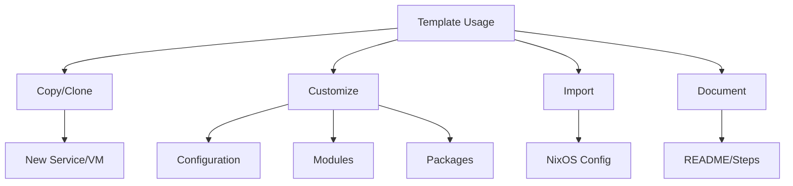
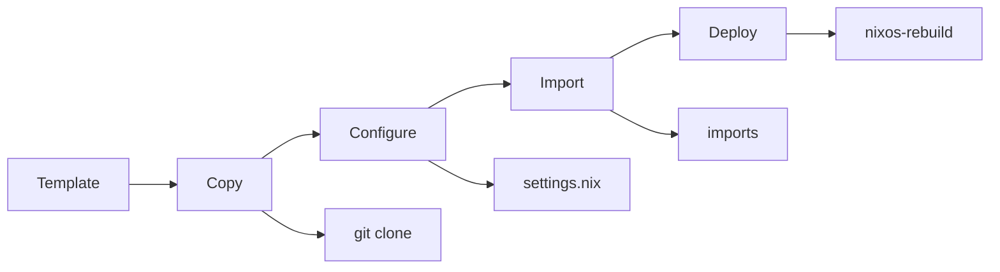
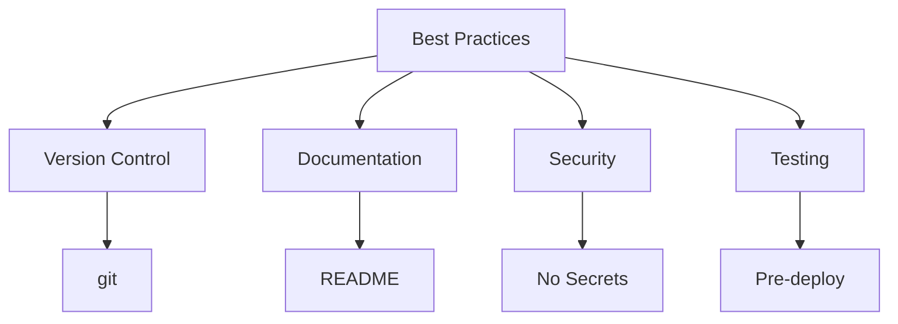
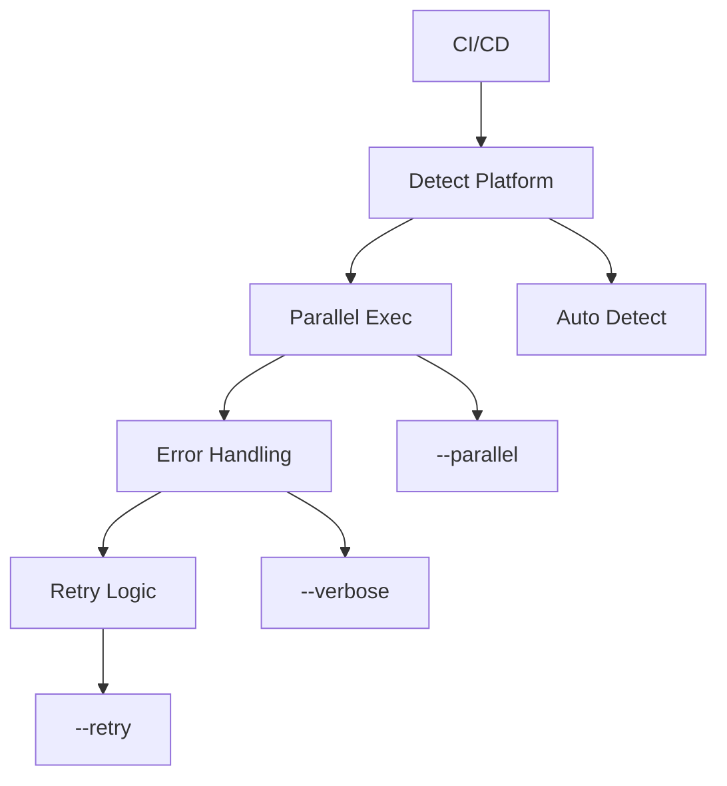
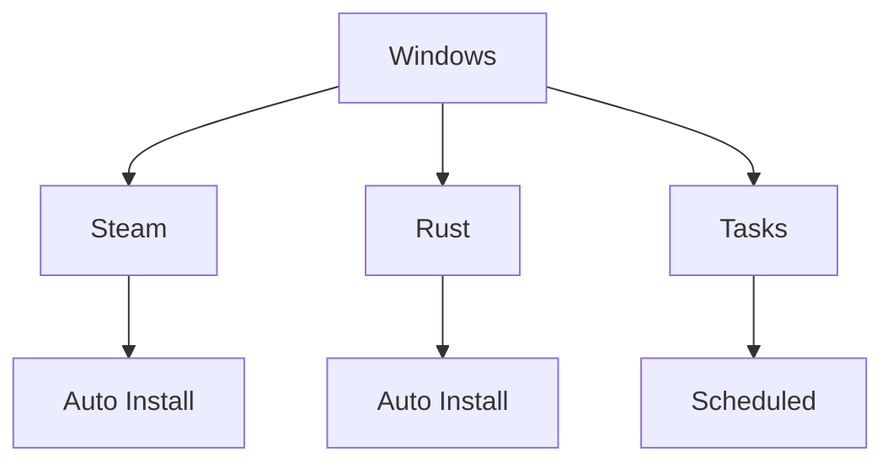
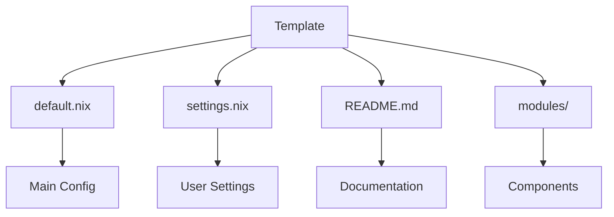

# Template Usage & Best Practices



## Quick Start



1. **Copy Template**
   ```bash
   cp -r templates/web-server my-server
   ```

2. **Configure Settings**
   ```nix
   # my-server/settings.nix
   {
     hostname = "my-web-server";
     networking = {
       ip = "192.168.1.100";
       gateway = "192.168.1.1";
     };
   }
   ```

3. **Import & Deploy**
   ```nix
   # configuration.nix
   imports = [ ./my-server ];
   ```

## Best Practices



### Core Guidelines

- **Version Control**
  - Use git for all templates
  - Document changes clearly
  - Tag stable versions

- **Security**
  - Remove sensitive data
  - Use secrets management
  - Follow least privilege

- **Testing**
  - Test before production
  - Use CI/CD pipeline
  - Verify all features

## CI/CD Integration



### CI Mode Features

```bash
# Basic CI Usage
export CI=true
./scripts/nix-mox --script install --parallel --verbose

# Advanced Usage
./scripts/nix-mox --script install --parallel --verbose --timeout 3600 --retry 3
```

## Windows Automation



### Quick Setup

```bash
# Build Assets
nix build .#windows-automation-assets

# Deploy
./install-steam-rust.nu
```

## Template Structure



### Directory Layout

```
template/
├── default.nix      # Main configuration
├── settings.nix     # User settings
├── README.md        # Documentation
└── modules/         # Components
    ├── web.nix
    ├── db.nix
    └── monitoring.nix
```

## Next Steps

- Review template-specific READMEs
- Check [Architecture Guide](../docs/ARCHITECTURE.md)
- Explore [Examples](../docs/nixamples/)
