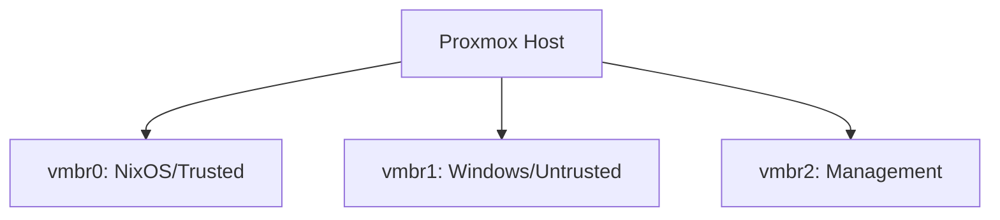
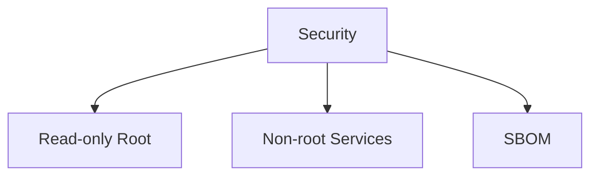
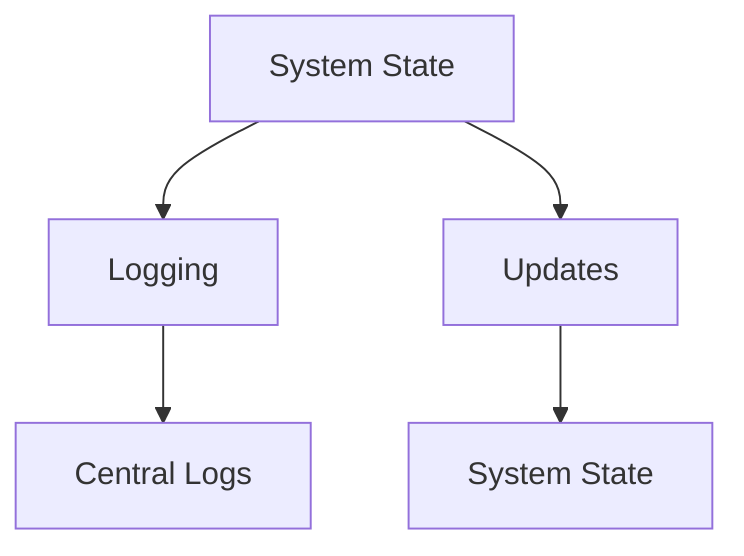
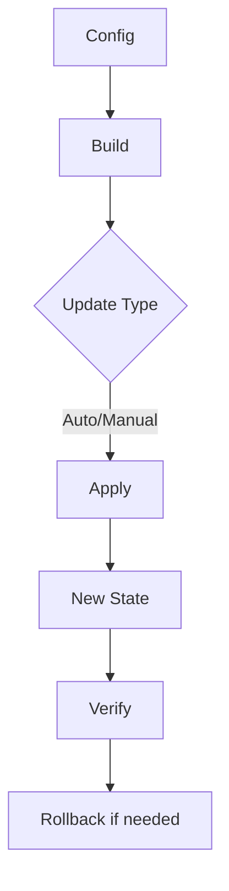
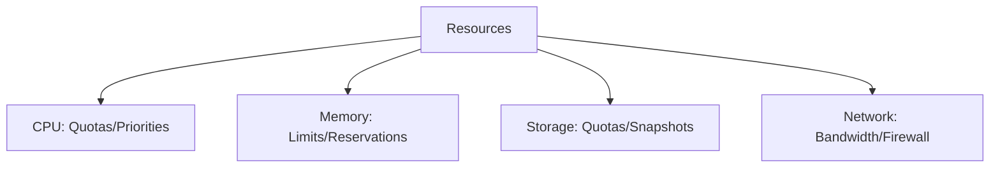
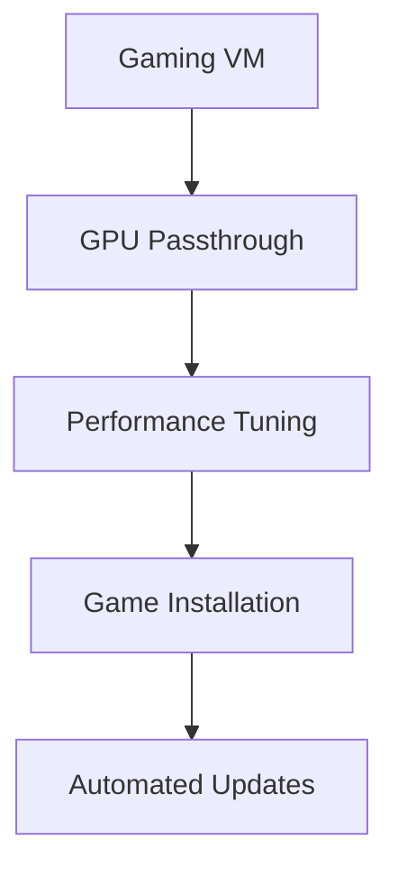

# Advanced Configuration Guide

## Network Architecture



## Storage Configuration

```mermaid
flowchart TD
    A[Proxmox Host] --> B[virtio-fs]
    B --> C[NixOS Guest]
    A --> D[/mnt/host/windows-share]
    C --> E[/mnt/guest/win-mount]
```

### Shared Storage

```nix
virtualisation.sharedDirectories = {
  win-share = {
    source = "/mnt/host/windows-share";
    target = "/mnt/guest/win-mount";
  };
};
```

## Security Architecture



### Security Config

```nix
# Read-only root
fileSystems."/".options = [ "ro" "nosuid" "nodev" ];

# Non-root service
users.users.nginx = {
  isSystemUser = true;
  group = "nginx";
};
services.nginx.user = "nginx";

# Generate SBOM
nix store make-content-addressable /nix/store/...-nginx-* --rewrite-outputs > sbom.json
```

## Monitoring & Updates



### Monitoring Setup

```nix
# Unified logging
services.journald.extraConfig = ''
  ForwardToSyslog=yes
  MaxLevelSyslog=debug
'';

# Automatic updates
system.autoUpgrade = {
  enable = true;
  flake = "github:user/nix-config#my-container";
  dates = "daily";
};
```

## System State Flow



## Resource Isolation



## Gaming Advanced Configuration



### Performance Tuning

```nix
{ config, ... }: {
  services.xserver.videoDrivers = [ "nvidia" ];
  hardware.opengl.enable = true;
  hardware.opengl.driSupport = true;
  hardware.opengl.driSupport32Bit = true;
  hardware.pulseaudio.support32Bit = true;
}
```
