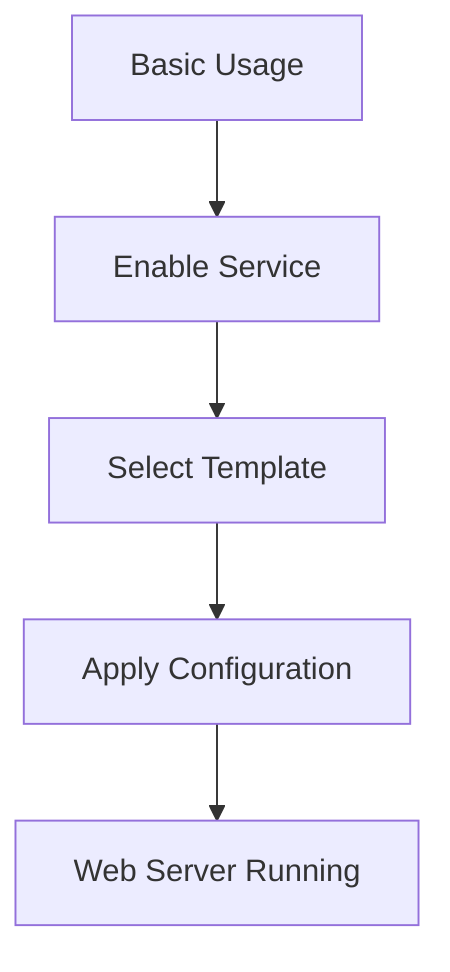

# Basic Template Usage

Simple example of using nix-mox templates with default settings.



## Configuration

```nix
# configuration.nix
{
  services.nix-mox.templates = {
    enable = true;
    templates = [ "web-server" ];
  };
}
```

## Features

- Nginx web server
- Default virtual host
- Basic security settings
- Standard logging

## Verification

1. Check service:

   ```bash
   systemctl status nginx
   ```

2. Test access:

   ```bash
   curl http://localhost
   ```

3. Verify config:

   ```bash
   nginx -t
   ```

## Troubleshooting

| Issue | Check | Solution |
|-------|-------|----------|
| Service won't start | `systemctl status nginx` | Check `/var/log/nginx/error.log` |
| Can't access site | `curl -v localhost` | Check firewall settings |
| Config errors | `nginx -t` | Review `/etc/nginx/nginx.conf` |

## Next Steps

- [Custom Options](../02-custom-options) for configuration
- [Template Composition](../03-composition) for complex setups
- [Template Variables](../05-variables) for dynamic config

## Common Questions

1. **Q: How do I change the default port?**
   A: Use [Custom Options](../02-custom-options) to modify the port configuration.

2. **Q: Can I use a different web server?**
   A: Yes, the template supports both Nginx and Apache. See [Custom Options](../02-custom-options).

3. **Q: How do I add SSL?**
   A: Enable SSL in [Custom Options](../02-custom-options) or use the [Secure Template](../04-inheritance).
