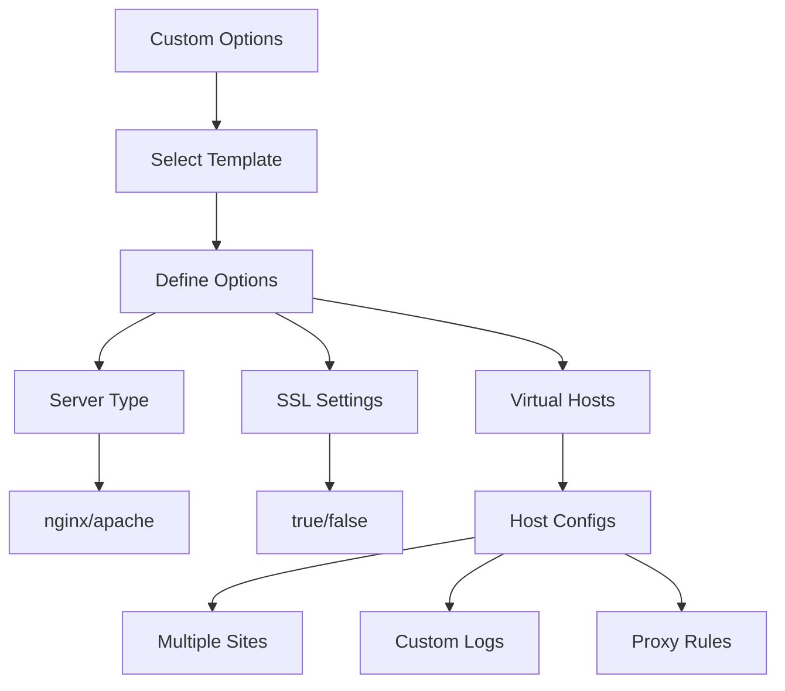

# Custom Template Options

This example shows how to customize a template's behavior using the `customOptions` attribute.



## Configuration

```nix
# configuration.nix
{
  services.nix-mox.templates = {
    enable = true;
    templates = [ "web-server" ];
    customOptions = {
      web-server = {
        serverType = "nginx";
        enableSSL = true;
        virtualHosts = [
          {
            name = "example";
            domain = "example.com";
            root = "/var/www/example";
            # Advanced options
            enableProxy = true;
            proxyPass = "http://localhost:3000";
            customLogs = true;
            logFormat = "combined";
            rateLimit = {
              enable = true;
              requests = 100;
              period = "1m";
            };
          }
        ];
      };
    };
  };
}
```

## Available Options

### Web Server Template

| Option | Type | Default | Description |
|--------|------|---------|-------------|
| `serverType` | string | "nginx" | Web server to use (nginx/apache) |
| `enableSSL` | boolean | false | Enable HTTPS support |
| `virtualHosts` | list | [] | List of virtual host configurations |

### Virtual Host Options

| Option | Type | Required | Description |
|--------|------|----------|-------------|
| `name` | string | yes | Unique identifier for the host |
| `domain` | string | yes | Domain name to serve |
| `root` | string | yes | Document root directory |
| `enableProxy` | boolean | false | Enable reverse proxy |
| `proxyPass` | string | - | Backend server URL |
| `customLogs` | boolean | false | Enable custom logging |
| `logFormat` | string | "combined" | Log format to use |
| `rateLimit` | object | - | Rate limiting configuration |

## Practical Scenarios

### 1. Development Environment

```nix
customOptions = {
  web-server = {
    serverType = "nginx";
    virtualHosts = [{
      name = "dev";
      domain = "dev.local";
      root = "/var/www/dev";
      enableProxy = true;
      proxyPass = "http://localhost:3000";
    }];
  };
};
```

### 2. Production Site

```nix
customOptions = {
  web-server = {
    serverType = "nginx";
    enableSSL = true;
    virtualHosts = [{
      name = "prod";
      domain = "example.com";
      root = "/var/www/prod";
      customLogs = true;
      rateLimit = {
        enable = true;
        requests = 1000;
        period = "1m";
      };
    }];
  };
};
```

### 3. Multi-Site Setup

```nix
customOptions = {
  web-server = {
    serverType = "nginx";
    virtualHosts = [
      {
        name = "site1";
        domain = "site1.com";
        root = "/var/www/site1";
      },
      {
        name = "site2";
        domain = "site2.com";
        root = "/var/www/site2";
      }
    ];
  };
};
```

## Advanced Features

### Rate Limiting

```nix
rateLimit = {
  enable = true;
  requests = 100;    # Number of requests
  period = "1m";     # Time period
  burst = 50;        # Burst allowance
  nodelay = true;    # No delay for burst
};
```

### Custom Logging

```nix
customLogs = true;
logFormat = "combined";
logPath = "/var/log/nginx/custom.log";
```

### Proxy Configuration

```nix
enableProxy = true;
proxyPass = "http://localhost:3000";
proxyHeaders = true;
proxyTimeout = "60s";
```

## Expected Outcome

After applying this configuration:

- Nginx will be installed and configured
- SSL will be enabled
- Virtual hosts will be set up
- Advanced features will be configured

## Verification

1. Check SSL:

   ```bash
   curl -v https://example.com
   ```

2. Test rate limiting:

   ```bash
   ab -n 200 -c 10 http://example.com/
   ```

3. Verify proxy:

   ```bash
   curl -H "Host: example.com" http://localhost
   ```

## Next Steps

- Try [Template Composition](../03-composition) to add a database
- Learn about [Template Inheritance](../04-inheritance) for secure setups
- Explore [Template Variables](../05-variables) for dynamic domains
