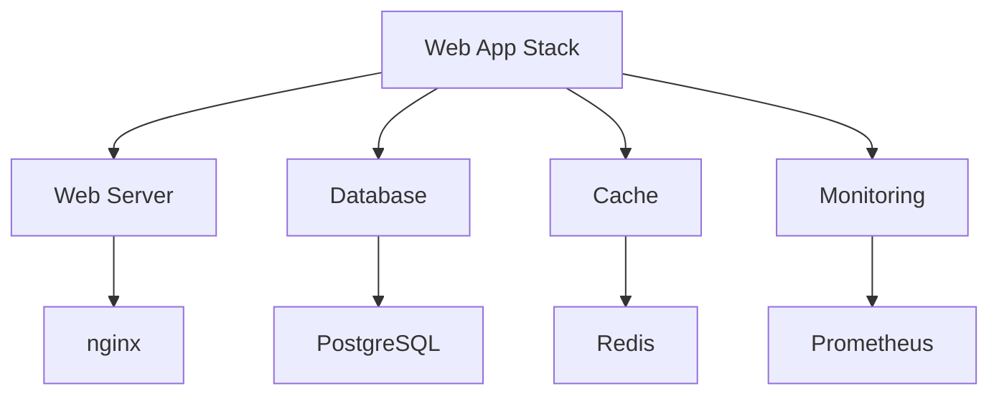

# Template Composition

Create complete web application stacks by combining templates.



## Configuration

```nix
# configuration.nix
{
  services.nix-mox.templates = {
    enable = true;
    templates = [ "web-app-stack" ];
    customOptions = {
      web-server = {
        serverType = "nginx";
        enableSSL = true;
        virtualHosts = [{
          name = "app";
          domain = "app.example.com";
          root = "/var/www/app";
          enableProxy = true;
          proxyPass = "http://localhost:3000";
        }];
      };
      database-management = {
        dbType = "postgresql";
        enableBackups = true;
        backupSchedule = "0 0 * * *";
      };
      cache-service = {
        cacheType = "redis";
        persistence = true;
      };
      monitoring-stack = {
        enablePrometheus = true;
        enableGrafana = true;
      };
    };
  };
}
```

## Stack Examples

### Basic Web Stack

```nix
templates = [ "web-stack" ];
customOptions = {
  web-server = { serverType = "nginx"; };
  database-management = { dbType = "postgresql"; };
};
```

### Production Stack

```nix
templates = [ "production-stack" ];
customOptions = {
  web-server = { enableSSL = true; };
  database-management = { enableBackups = true; };
  cache-service = { persistence = true; };
  monitoring-stack = { enablePrometheus = true; };
};
```

## Component Options

### Web Server

| Option | Type | Default | Description |
|--------|------|---------|-------------|
| `serverType` | string | "nginx" | Web server |
| `enableSSL` | boolean | false | HTTPS |
| `virtualHosts` | list | [] | Host configs |

### Database

| Option | Type | Default | Description |
|--------|------|---------|-------------|
| `dbType` | string | "postgresql" | Database |
| `enableBackups` | boolean | false | Backups |
| `backupSchedule` | string | "0 0 ** *" | Schedule |

### Cache

| Option | Type | Default | Description |
|--------|------|---------|-------------|
| `cacheType` | string | "redis" | Cache system |
| `persistence` | boolean | false | Persistence |
| `maxMemory` | string | "1gb" | Memory limit |

### Monitoring

| Option | Type | Default | Description |
|--------|------|---------|-------------|
| `enablePrometheus` | boolean | false | Prometheus |
| `enableGrafana` | boolean | false | Grafana |
| `alertRules` | object | {} | Alerts |

## Features

- High availability: Load balancing, replication
- Security: SSL/TLS, encryption, auth
- Performance: Connection pooling, caching
- Monitoring: Metrics, alerts, dashboards

## Verification

1. Web server:

   ```bash
   curl -v https://app.example.com
   ```

2. Database:

   ```bash
   psql -h localhost -U postgres -d app
   ```

3. Cache:

   ```bash
   redis-cli ping
   ```

4. Monitoring:

   ```bash
   curl localhost:9090/metrics
   ```

## Next Steps

- [Template Inheritance](../04-inheritance) for security
- [Template Variables](../05-variables) for config
- [Template Overrides](../06-overrides) for custom
