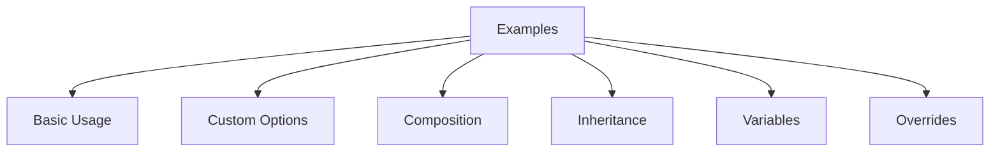

# nix-mox Examples

## Overview

## Example Categories

### 1. Basic Usage (`01-basic-usage/`)

- Simple template deployment
- Basic configuration
- Quick start guide
- First-time setup

### 2. Custom Options (`02-custom-options/`)

- Environment-specific settings
- Multi-site configurations
- Development/Production environments
- Custom configurations

### 3. Template Composition (`03-composition/`)

- Web application stacks
- Database configurations
- Monitoring setups
- Full-stack applications

### 4. Template Inheritance (`04-inheritance/`)

- Security templates
- Base configurations
- Feature extensions
- Secure deployments

### 5. Template Variables (`05-variables/`)

- Dynamic configurations
- Environment variables
- Secret management
- Environment-specific configs

### 6. Template Overrides (`06-overrides/`)

- Custom configurations
- File replacements
- Conditional overrides
- Special configurations

## Getting Started

1. Choose matching example
2. Review README.md
3. Follow configuration steps
4. Test deployment
5. Customize as needed

## Best Practices

- Start with basic examples
- Review diagrams
- Follow verification steps
- Use composition for complex setups
- Leverage inheritance for security

## Contributing

1. Use clear documentation
2. Include diagrams
3. Provide use cases
4. Add verification steps
5. Include troubleshooting

## Next Steps

- [Main Documentation](../USAGE.md)
- [Architecture Guide](../ARCHITECTURE.md)
- [Roadmap](../ROADMAP.md)
