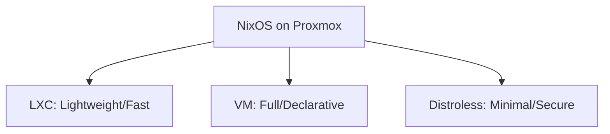
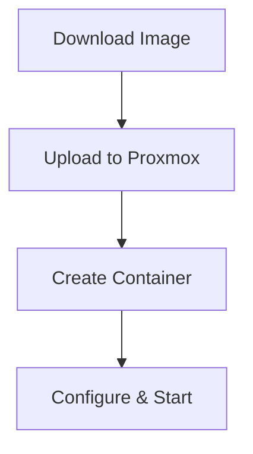
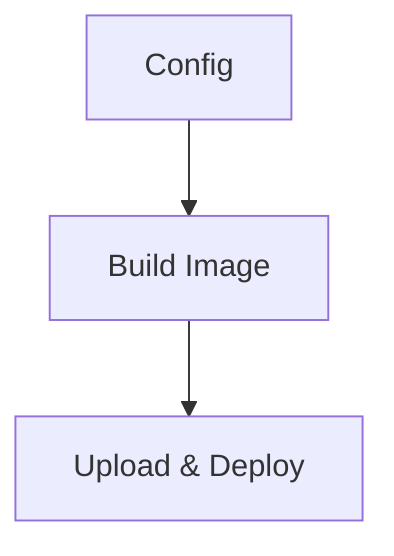
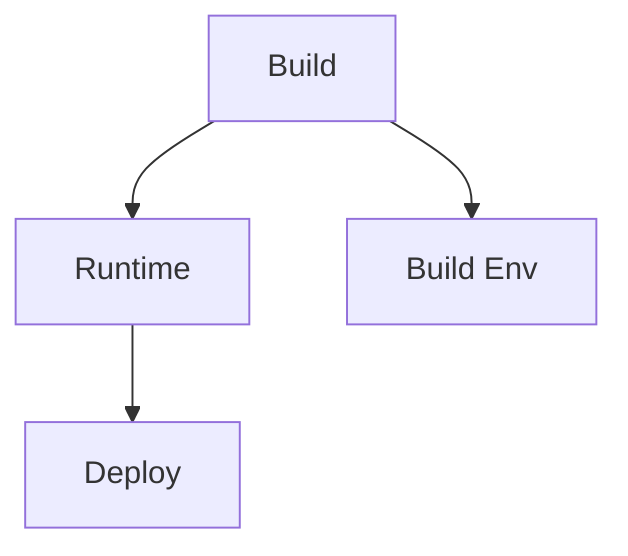
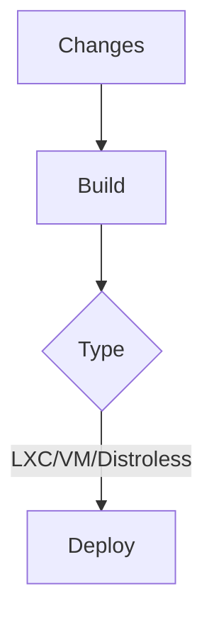
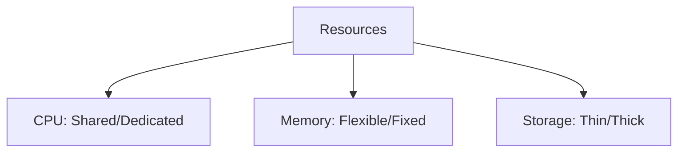
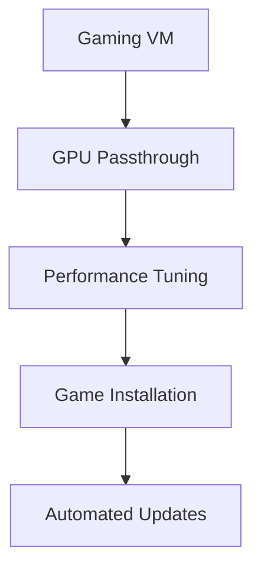

# NixOS on Proxmox Guide

## Deployment Options



## Default Configuration Template

For users who want to avoid common display issues when setting up NixOS, nix-mox provides a **Safe Configuration Template** that ensures proper display services are enabled.

### Quick Start with Safe Template

```bash
# Use the nix-mox safe configuration template
nix-mox-template-safe-configuration

# Or run the interactive setup script
./modules/templates/nixos/safe-configuration/setup.sh
```

### Key Features

- **Display Safety**: Explicitly enables display services to prevent CLI lock
- **nix-mox Integration**: Includes your nix-mox packages and development shells
- **Gaming Ready**: Steam enabled with proper graphics driver configuration
- **Development Friendly**: Includes common development tools and aliases
- **Messaging & Communication**: Signal Desktop, Telegram Desktop, Discord, Slack, and more

### Manual Setup

1. **Create configuration directory:**

   ```bash
   mkdir -p ~/nixos-config
   cd ~/nixos-config
   ```

2. **Copy template files from:**

   ```bash
   modules/templates/nixos/safe-configuration/
   ```

3. **Generate hardware configuration:**

   ```bash
   sudo nixos-generate-config --show-hardware-config > hardware-configuration.nix
   ```

4. **Update configuration:**
   - Change hostname from "hydebox"
   - Change username from "hyde"
   - Configure graphics drivers
   - Set your timezone

5. **Build and switch:**

   ```bash
   sudo nixos-rebuild switch --flake .#your-hostname
   ```

### Configuration Options

The safe template supports various customization options:

```nix
services.nix-mox.templates.customOptions.safe-configuration = {
  hostname = "my-nixos-system";
  username = "myuser";
  timezone = "America/New_York";
  displayManager = "lightdm";  # lightdm, sddm, gdm
  desktopEnvironment = "gnome";  # gnome, plasma5, xfce, i3, awesome
  graphicsDriver = "auto";  # auto, nvidia, amdgpu, intel
  enableSteam = true;
  enableDocker = true;
  enableSSH = true;
};
```

### Troubleshooting Display Issues

If you still encounter display problems:

1. **Check logs:**

   ```bash
   journalctl -b -u display-manager
   ```

2. **Try different display manager:**

   ```nix
   services.xserver.displayManager = {
     sddm.enable = true;  # Instead of lightdm
   };
   ```

3. **Use minimal window manager:**

   ```nix
   services.xserver.windowManager.i3.enable = true;
   ```

4. **Rollback if needed:**

   ```bash
   sudo nixos-rebuild switch --rollback
   ```

### Using nix-mox After Setup

After setting up your NixOS system with the safe template:

```bash
# Your nix-mox packages are available system-wide
proxmox-update
vzdump-backup
zfs-snapshot
nixos-flake-update

# Access development shells via aliases
dev-default      # Opens default development shell
dev-development  # Opens development tools shell
dev-testing      # Opens testing shell
dev-services     # Opens services shell
dev-monitoring   # Opens monitoring shell
dev-gaming       # Opens gaming development shell (Linux x86_64 only)
dev-zfs          # Opens ZFS tools shell (Linux only)
dev-macos        # Opens macOS development shell (macOS only)

# Or directly
nix develop github:Hydepwns/nix-mox#default
nix develop github:Hydepwns/nix-mox#development
nix develop github:Hydepwns/nix-mox#testing
nix develop github:Hydepwns/nix-mox#services
nix develop github:Hydepwns/nix-mox#monitoring
nix develop github:Hydepwns/nix-mox#gaming
nix develop github:Hydepwns/nix-mox#zfs
nix develop github:Hydepwns/nix-mox#macos
```

## LXC Container Setup



### Quick Setup

```bash
pct create <VMID> local:vztmpl/nixos-*.tar.xz \
  --ostype unmanaged \
  --features nesting=1 \
  --net0 name=eth0,bridge=vmbr0,ip=dhcp
```

## VM Deployment



### Configuration

```nix
{ config, ... }: {
  imports = [ <nixpkgs/nixos/modules/profiles/qemu-guest.nix> ];
  services.qemuGuest.enable = true;
}
```

### Build & Deploy

```bash
# Build image
nixos-generate -f proxmox -c configuration.nix

# Deploy
qmrestore /path/to/image.vma.zst <VMID>

# Remote update
nixos-rebuild switch --flake .#myVmName --target-host root@vm-ip
```

## Distroless Containers



### Minimal Example

```nix
pkgs.dockerTools.buildImage {
  name = "distroless-app";
  config = { 
    Cmd = [ "${pkgs.nginx}/bin/nginx" "-g" "daemon off;" ]; 
  };
}
```

### Flake Configuration

```nix
{
  outputs = { nixpkgs, ... }: {
    nixosConfigurations.my-container = nixpkgs.lib.nixosSystem {
      system = "x86_64-linux";
      modules = [ ({ pkgs, ... }: {
        environment.systemPackages = [ pkgs.nginx ];
        system.stateVersion = "24.11";
        boot.isContainer = true;
      }) ];
    };
  };
}
```

## Update Flow



## Resource Allocation



## Gaming Configuration



### Performance Tuning

> **Note:** NVIDIA and OpenGL settings are now enabled by default in the NixOS VM template for maximum compatibility. You do not need to add these manually unless you wish to override them.

```nix
{ config, ... }: {
  services.xserver.videoDrivers = [ "nvidia" ];
  hardware.opengl.enable = true;
  hardware.opengl.driSupport = true;
  hardware.opengl.driSupport32Bit = true;
  hardware.pulseaudio.support32Bit = true;
}
```

> **See also:** [Hardware Drivers Guide](./drivers.md) for detailed driver setup and troubleshooting.
