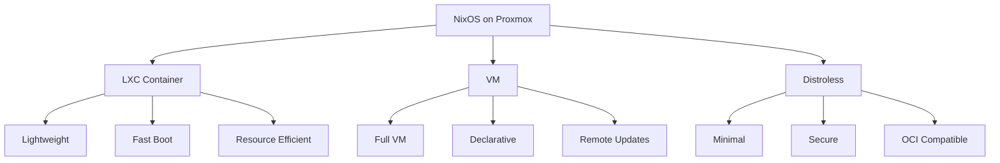
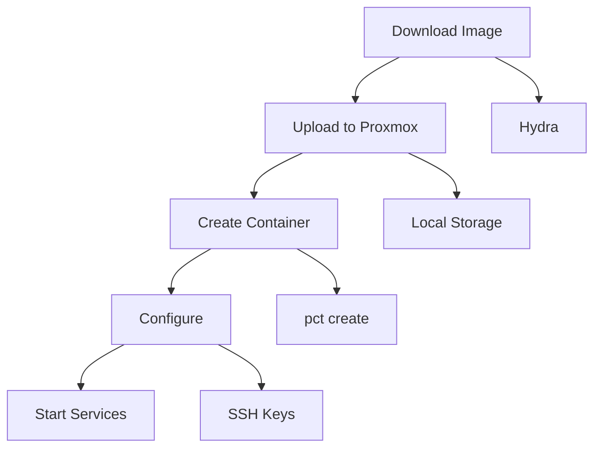
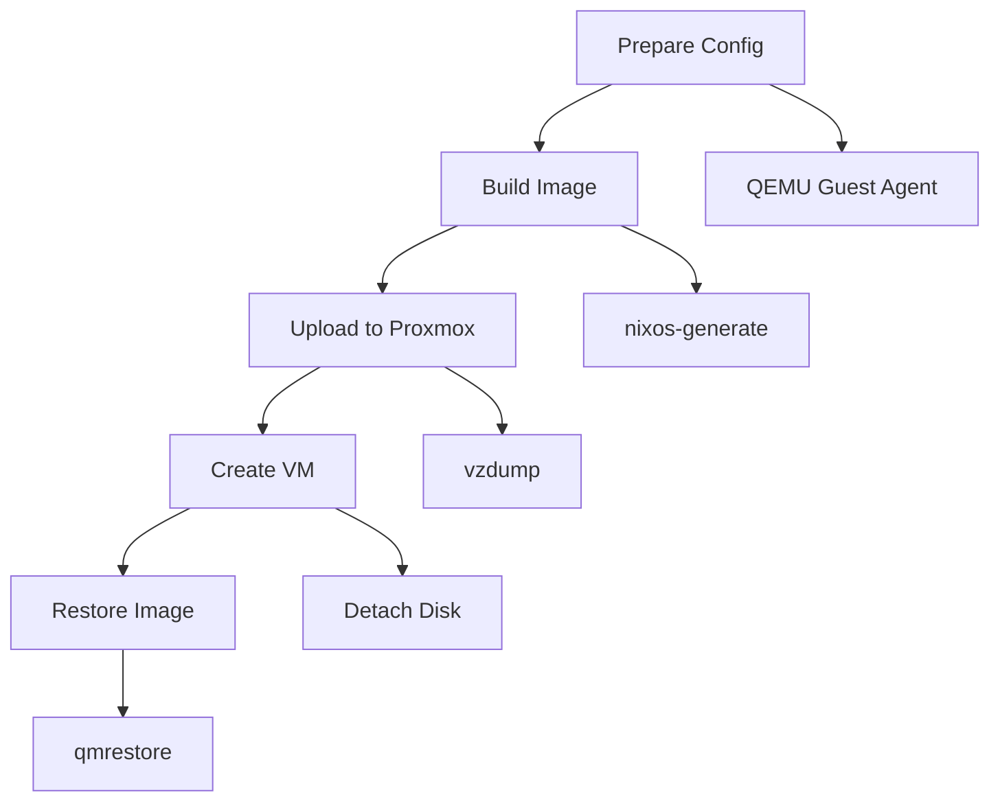
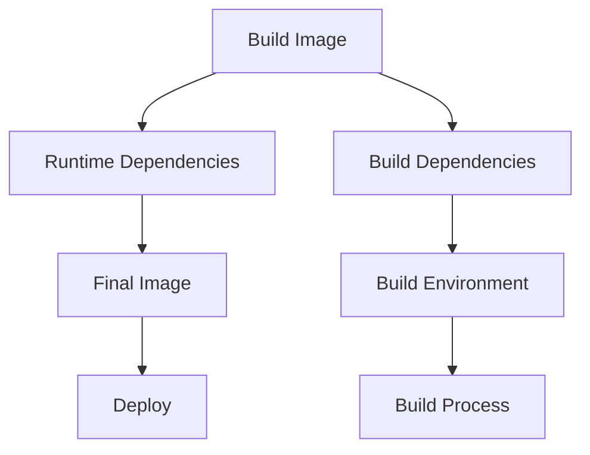
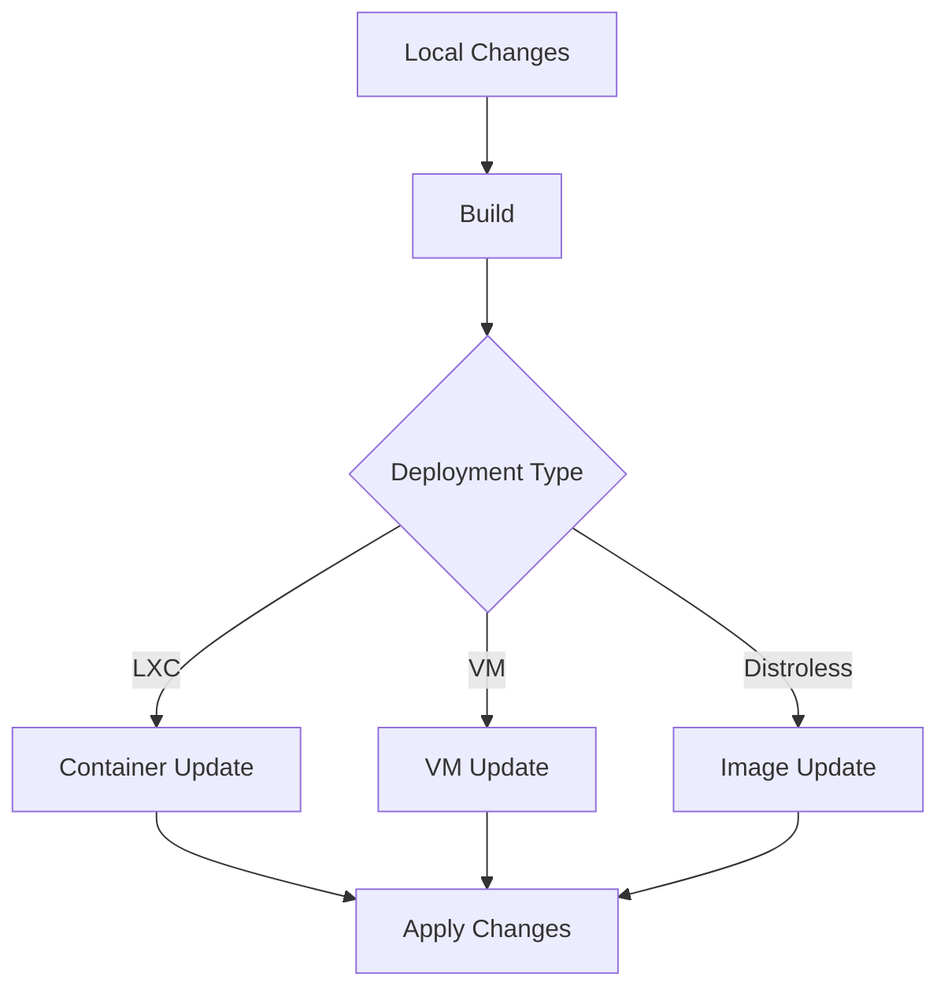
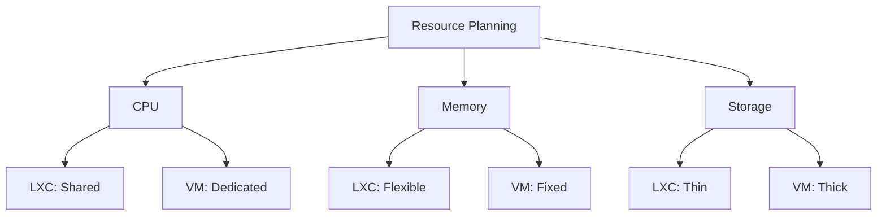

# NixOS on Proxmox Guide

Terse guide for deploying NixOS on Proxmox via LXC, VM, or distroless containers.

## Deployment Options



## LXC Container Setup



### Quick Setup

```bash
# Create container
pct create <VMID> local:vztmpl/nixos-*.tar.xz \
  --ostype unmanaged \
  --features nesting=1 \
  --net0 name=eth0,bridge=vmbr0,ip=dhcp
```

## VM Deployment



### Configuration

```nix
# configuration.nix
{ config, ... }: {
  imports = [ <nixpkgs/nixos/modules/profiles/qemu-guest.nix> ];
  services.qemuGuest.enable = true;
}
```

### Build & Deploy

```bash
# Build image
nixos-generate -f proxmox -c configuration.nix

# Deploy
qmrestore /path/to/image.vma.zst <VMID>

# Remote update
nixos-rebuild switch --flake .#myVmName --target-host root@vm-ip
```

## Distroless Containers



### Minimal Example

```nix
# Minimal nginx container
pkgs.dockerTools.buildImage {
  name = "distroless-app";
  config = { 
    Cmd = [ "${pkgs.nginx}/bin/nginx" "-g" "daemon off;" ]; 
  };
}
```

### Multi-stage Build

```nix
# Multi-stage container build
let
  buildEnv = pkgs.buildEnv { ... };
  runtimeEnv = pkgs.runtimeOnlyDependencies buildEnv;
in
pkgs.dockerTools.buildImage {
  copyToRoot = runtimeEnv;
}
```

### Flake Configuration

```nix
# flake.nix
{
  outputs = { nixpkgs, ... }: {
    nixosConfigurations.my-container = nixpkgs.lib.nixosSystem {
      system = "x86_64-linux";
      modules = [ ({ pkgs, ... }: {
        environment.systemPackages = [ pkgs.nginx ];
        system.stateVersion = "24.11";
        boot.isContainer = true;
      }) ];
    };
  };
}
```

## Update Flow



## Resource Allocation


