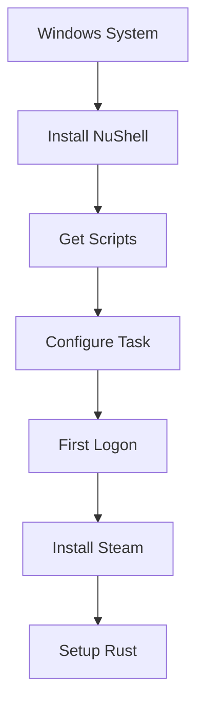
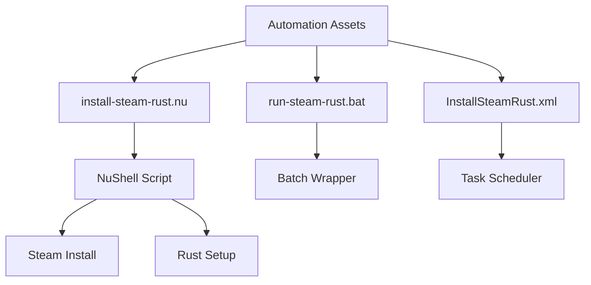
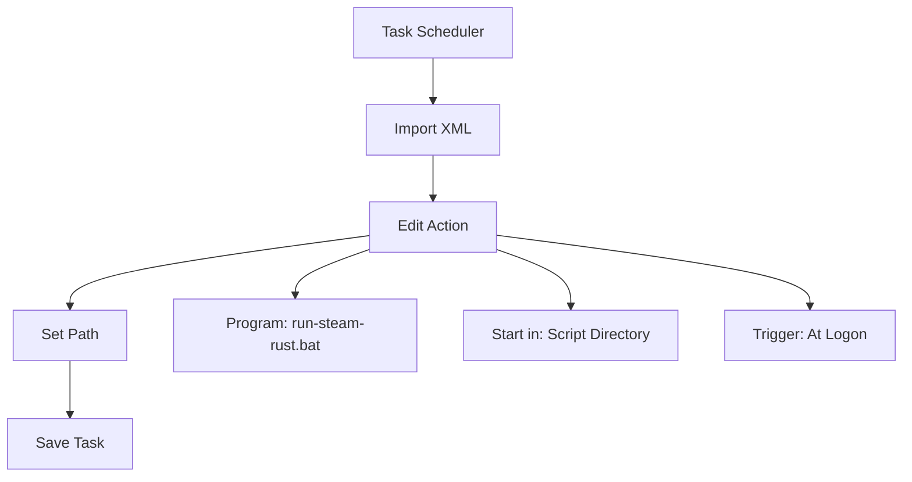
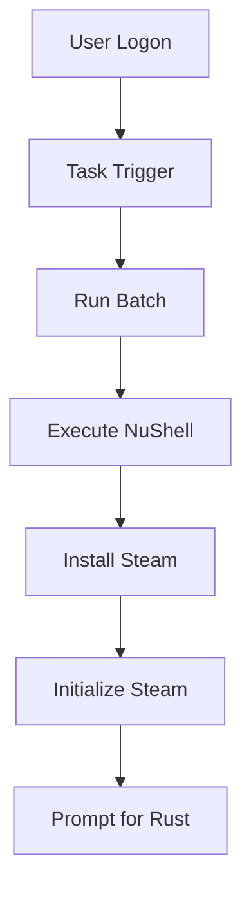
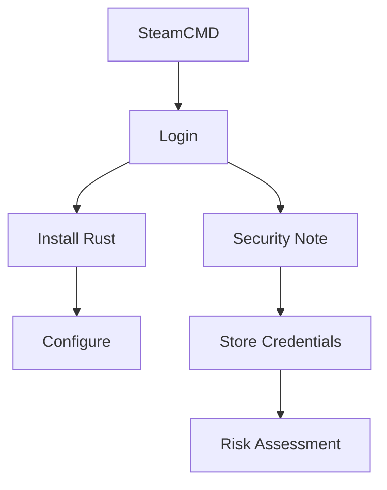

# Windows Automation Guide

Terse guide for automating Steam + Rust installation on Windows using NuShell.

## Automation Flow



## Script Components



## Quick Setup

1. **Get Scripts**
   ```bash
   # Build package
   nix build .#windows-automation-assets-sources
   
   # Copy to Windows
   cp result/* C:/nix-mox-scripts/
   ```

2. **Install NuShell**
   ```powershell
   # Using Chocolatey
   choco install nushell -y
   
   # Verify
   nu --version
   ```

3. **Configure Task**
   ```batch
   # Edit run-steam-rust.bat
   nu "%~dp0install-steam-rust.nu" %*
   ```

4. **Register Task**
   ```powershell
   # Import task
   schtasks /create /tn InstallSteamRust /xml InstallSteamRust.xml
   ```

## Task Configuration



## First Logon Process



## Optional: Self-Destruct Task

```nu
# Add to install-steam-rust.nu
log_info "Deleting scheduled task"
try {
    run-external "schtasks.exe" "/Delete" "/TN" "InstallSteamRust" "/F"
    log_success "Task deleted"
} catch {
    log_warn "Could not delete task"
}
```

## Optional: Headless Install



For full headless installation details, see comments in `../scripts/windows/install-steam-rust.nu`.
