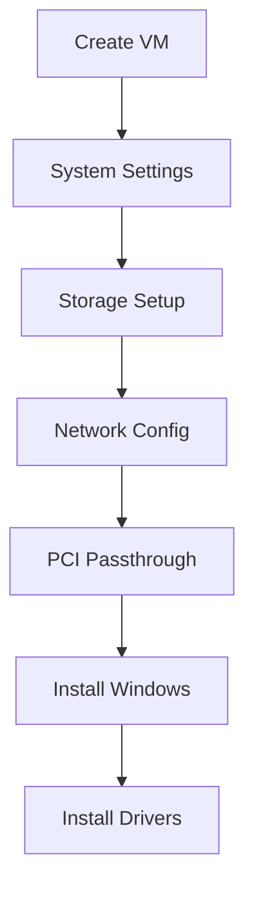
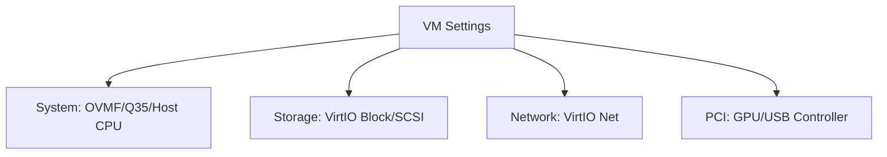
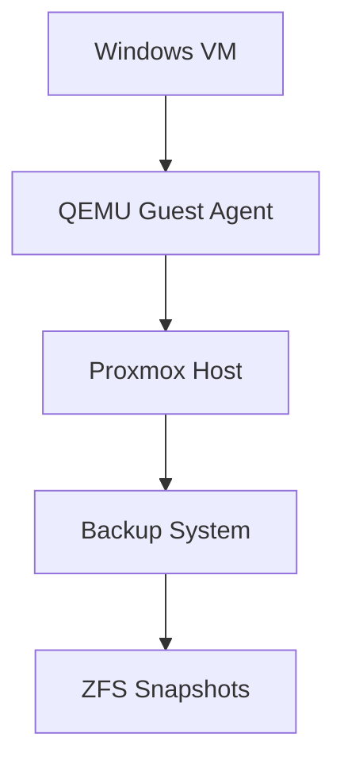
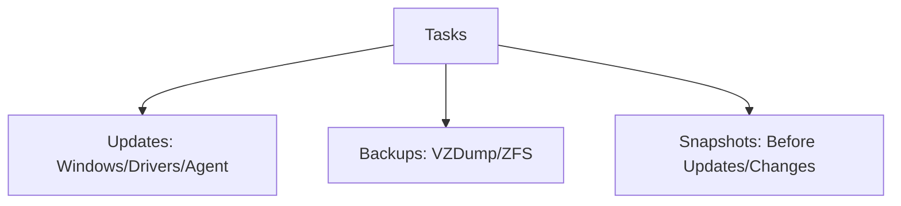
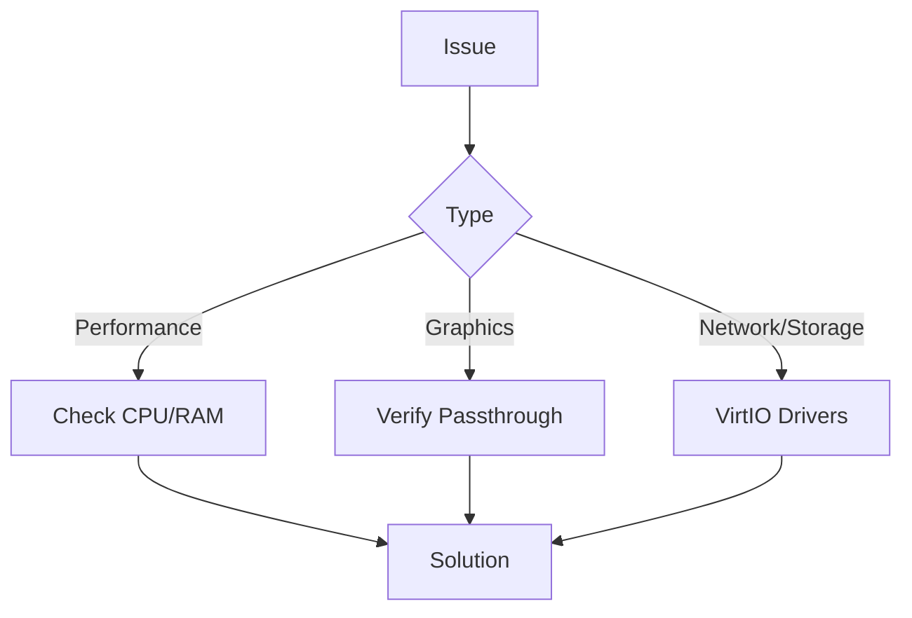

# Windows on Proxmox Guide

## VM Creation Flow



## System Configuration



## Quick Setup

1. **Create VM**

   ```bash
   # System
   - BIOS: OVMF (UEFI)
   - Machine: q35
   - CPU: host
   
   # Storage
   - Bus: VirtIO Block/SCSI
   
   # Network
   - Model: VirtIO
   ```

2. **Install Drivers**

   ```bash
   # Download & attach VirtIO ISO
   wget https://fedorapeople.org/groups/virt/virtio-win/direct-downloads/stable-virtio/virtio-win.iso
   
   # Required drivers
   - viostor (storage)
   - NetKVM (network)
   - QEMU Guest Agent
   ```

3. **PCI Passthrough**

   ```bash
   # Add to VM config
   -device vfio-pci,host=01:00.0,multifunction=on  # GPU
   -device vfio-pci,host=01:00.1                  # GPU Audio
   -device vfio-pci,host=03:00.0                  # USB Controller
   ```

## Update Flow



## Maintenance



## Troubleshooting



For detailed troubleshooting and advanced configuration, see the [Proxmox PCI Passthrough Guide](https://pve.proxmox.com/wiki/Pci_passthrough).
