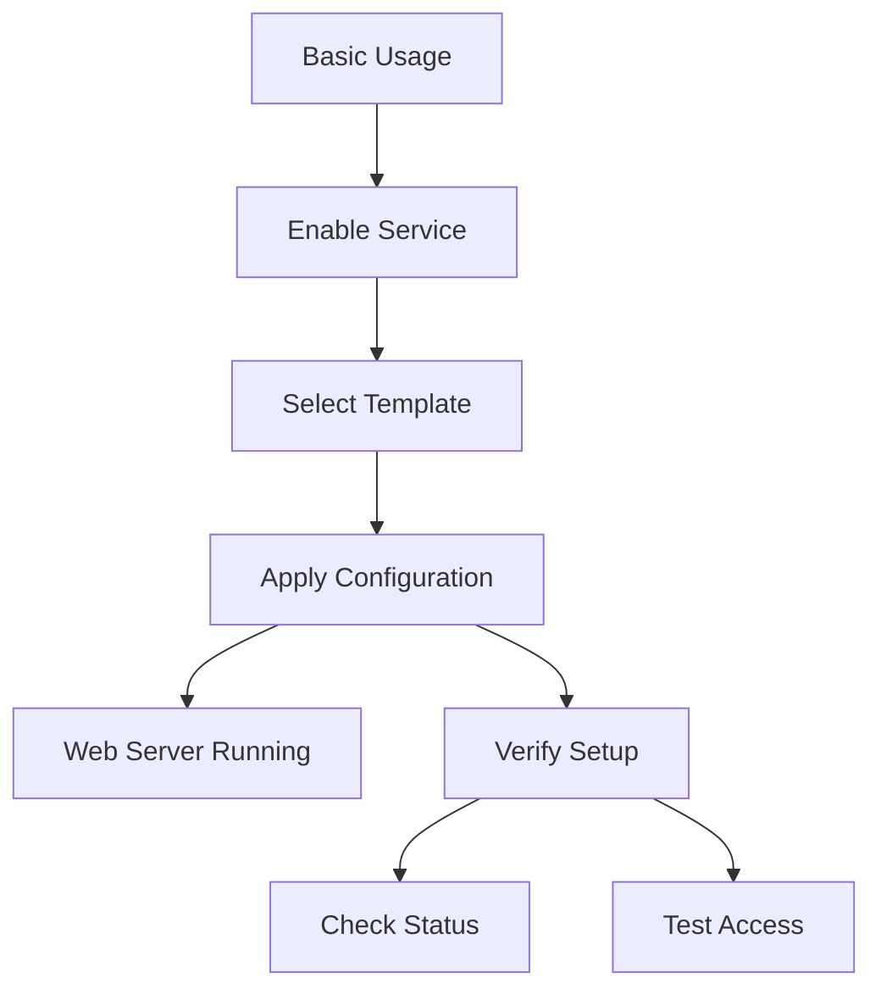

# Basic Template Usage

This example demonstrates the simplest way to use nix-mox templates - enabling a single template with default settings.



## Configuration

```nix
# configuration.nix
{
  services.nix-mox.templates = {
    enable = true;
    templates = [ "web-server" ];
  };
}
```

## What This Does

1. Enables the nix-mox template service
2. Activates the `web-server` template with default settings
3. Creates a basic web server configuration

## Practical Use Case

### Quick Development Server

This basic setup is perfect for:

- Local development environments
- Testing new web applications
- Learning web server configuration
- Prototyping new features

### Default Configuration

The template provides:

- Nginx web server
- Default virtual host
- Basic security settings
- Standard logging

## Expected Outcome

After applying this configuration:

- A web server will be installed and configured
- Default settings will be used for all options
- The service will start automatically

## Verification Steps

1. Check service status:

   ```bash
   systemctl status nginx
   ```

2. Test web access:

   ```bash
   curl http://localhost
   ```

3. Verify configuration:

   ```bash
   nginx -t
   ```

## Troubleshooting

| Issue | Check | Solution |
|-------|-------|----------|
| Service won't start | `systemctl status nginx` | Check logs in `/var/log/nginx/error.log` |
| Can't access site | `curl -v localhost` | Verify firewall settings |
| Config errors | `nginx -t` | Review syntax in `/etc/nginx/nginx.conf` |

## Next Steps

- Try [Custom Options](../02-custom-options) to configure the template
- Learn about [Template Composition](../03-composition) for more complex setups
- Explore [Template Variables](../05-variables) for dynamic configuration

## Common Questions

1. **Q: How do I change the default port?**
   A: Use [Custom Options](../02-custom-options) to modify the port configuration.

2. **Q: Can I use a different web server?**
   A: Yes, the template supports both Nginx and Apache. See [Custom Options](../02-custom-options).

3. **Q: How do I add SSL?**
   A: Enable SSL in [Custom Options](../02-custom-options) or use the [Secure Template](../04-inheritance).
