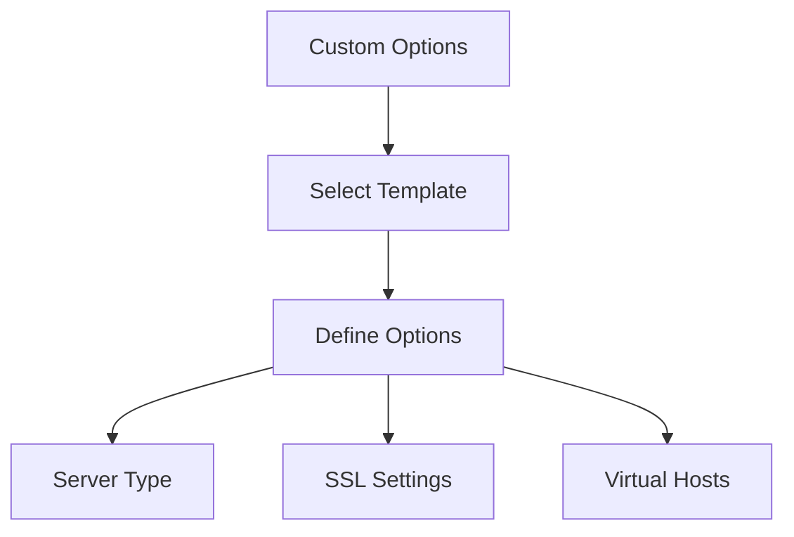

# Custom Template Options

Customize template behavior using `customOptions`.



## Configuration

```nix
# configuration.nix
{
  services.nix-mox.templates = {
    enable = true;
    templates = [ "web-server" ];
    customOptions = {
      web-server = {
        serverType = "nginx";
        enableSSL = true;
        virtualHosts = [
          {
            name = "example";
            domain = "example.com";
            root = "/var/www/example";
            enableProxy = true;
            proxyPass = "http://localhost:3000";
            customLogs = true;
            logFormat = "combined";
            rateLimit = {
              enable = true;
              requests = 100;
              period = "1m";
            };
          }
        ];
      };
    };
  };
}
```

## Available Options

### Web Server Template

| Option | Type | Default | Description |
|--------|------|---------|-------------|
| `serverType` | string | "nginx" | Web server (nginx/apache) |
| `enableSSL` | boolean | false | Enable HTTPS |
| `virtualHosts` | list | [] | Virtual host configs |

### Virtual Host Options

| Option | Type | Required | Description |
|--------|------|----------|-------------|
| `name` | string | yes | Host identifier |
| `domain` | string | yes | Domain name |
| `root` | string | yes | Document root |
| `enableProxy` | boolean | false | Reverse proxy |
| `proxyPass` | string | - | Backend URL |
| `customLogs` | boolean | false | Custom logging |
| `logFormat` | string | "combined" | Log format |
| `rateLimit` | object | - | Rate limiting |

## Examples

### Development

```nix
customOptions = {
  web-server = {
    serverType = "nginx";
    virtualHosts = [{
      name = "dev";
      domain = "dev.local";
      root = "/var/www/dev";
      enableProxy = true;
      proxyPass = "http://localhost:3000";
    }];
  };
};
```

### Production

```nix
customOptions = {
  web-server = {
    serverType = "nginx";
    enableSSL = true;
    virtualHosts = [{
      name = "prod";
      domain = "example.com";
      root = "/var/www/prod";
      customLogs = true;
      rateLimit = {
        enable = true;
        requests = 1000;
        period = "1m";
      };
    }];
  };
};
```

## Verification

1. Check SSL:

   ```bash
   curl -v https://example.com
   ```

2. Test rate limit:

   ```bash
   ab -n 200 -c 10 http://example.com/
   ```

3. Verify proxy:

   ```bash
   curl -H "Host: example.com" http://localhost
   ```

## Next Steps

- [Template Composition](../03-composition) for databases
- [Template Inheritance](../04-inheritance) for security
- [Template Variables](../05-variables) for dynamic config
