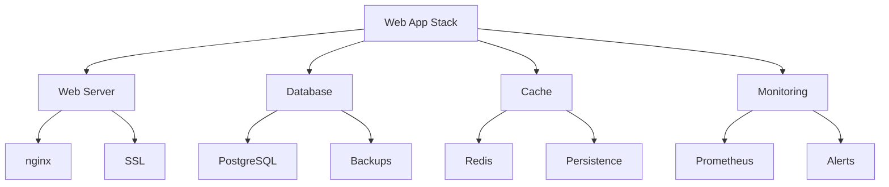

# Template Composition

This example demonstrates how to use composite templates to create a complete web application stack.



## Configuration

```nix
# configuration.nix
{
  services.nix-mox.templates = {
    enable = true;
    templates = [ "web-app-stack" ];
    customOptions = {
      web-server = {
        serverType = "nginx";
        enableSSL = true;
        virtualHosts = [{
          name = "app";
          domain = "app.example.com";
          root = "/var/www/app";
          enableProxy = true;
          proxyPass = "http://localhost:3000";
        }];
      };
      database-management = {
        dbType = "postgresql";
        enableBackups = true;
        backupSchedule = "0 0 * * *";
        backupRetention = "7d";
      };
      cache-service = {
        cacheType = "redis";
        persistence = true;
        maxMemory = "1gb";
      };
      monitoring-stack = {
        enablePrometheus = true;
        enableGrafana = true;
        alertRules = {
          highCpu = "cpu_usage > 80%";
          highMemory = "memory_usage > 90%";
        };
      };
    };
  };
}
```

## Available Stacks

### 1. Basic Web Stack

```nix
templates = [ "web-stack" ];
customOptions = {
  web-server = { serverType = "nginx"; };
  database-management = { dbType = "postgresql"; };
};
```

### 2. Full Production Stack

```nix
templates = [ "production-stack" ];
customOptions = {
  web-server = { enableSSL = true; };
  database-management = { enableBackups = true; };
  cache-service = { persistence = true; };
  monitoring-stack = { enablePrometheus = true; };
};
```

### 3. Development Stack

```nix
templates = [ "dev-stack" ];
customOptions = {
  web-server = { serverType = "nginx"; };
  database-management = { dbType = "postgresql"; };
  cache-service = { cacheType = "redis"; };
};
```

## Component Options

### Web Server

| Option | Type | Default | Description |
|--------|------|---------|-------------|
| `serverType` | string | "nginx" | Web server to use |
| `enableSSL` | boolean | false | Enable HTTPS |
| `virtualHosts` | list | [] | Virtual host configs |

### Database

| Option | Type | Default | Description |
|--------|------|---------|-------------|
| `dbType` | string | "postgresql" | Database system |
| `enableBackups` | boolean | false | Enable backups |
| `backupSchedule` | string | "0 0 ** *" | Cron schedule |
| `backupRetention` | string | "7d" | Retention period |

### Cache

| Option | Type | Default | Description |
|--------|------|---------|-------------|
| `cacheType` | string | "redis" | Cache system |
| `persistence` | boolean | false | Enable persistence |
| `maxMemory` | string | "1gb" | Max memory usage |

### Monitoring

| Option | Type | Default | Description |
|--------|------|---------|-------------|
| `enablePrometheus` | boolean | false | Enable Prometheus |
| `enableGrafana` | boolean | false | Enable Grafana |
| `alertRules` | object | {} | Alert rules |

## Stack Features

### High Availability

- Load balancing
- Database replication
- Cache clustering
- Monitoring redundancy

### Security

- SSL/TLS encryption
- Database encryption
- Cache authentication
- Monitoring access control

### Performance

- Connection pooling
- Query optimization
- Cache strategies
- Resource monitoring

## Expected Outcome

After applying this configuration:

- A complete web application stack will be deployed
- All components will be configured to work together
- Monitoring and backups will be set up
- High availability features will be enabled

## Verification

1. Check web server:

   ```bash
   curl -v https://app.example.com
   ```

2. Test database:

   ```bash
   psql -h localhost -U postgres -d app
   ```

3. Verify cache:

   ```bash
   redis-cli ping
   ```

4. Check monitoring:

   ```bash
   curl localhost:9090/metrics
   ```

## Next Steps

- Try [Template Inheritance](../04-inheritance) for secure configurations
- Learn about [Template Variables](../05-variables) for dynamic settings
- Explore [Template Overrides](../06-overrides) for custom configurations
