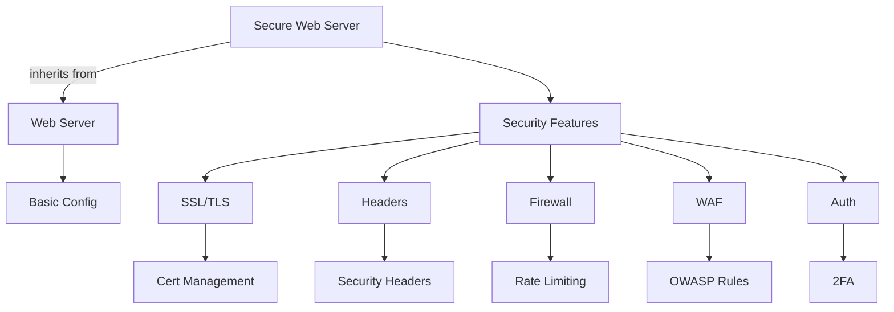

# Template Inheritance

This example shows how templates can inherit from and extend base templates, using the `secure-web-server` template that builds upon `web-server`.



## Configuration

```nix
# configuration.nix
{
  services.nix-mox.templates = {
    enable = true;
    templates = [ "secure-web-server" ];
    customOptions = {
      # The secure-web-server template inherits from web-server,
      # so we can still customize web-server options
      web-server = {
        serverType = "nginx";
        virtualHosts = [
          {
            name = "secure-site";
            domain = "secure.example.com";
            root = "/var/www/secure";
            # Inherited options can be overridden
            enableProxy = true;
            proxyPass = "http://localhost:3000";
          }
        ];
      };
      # We can also override the defaults from the child template
      secure-web-server = {
        enableSSL = true;
        securityLevel = "high";
        enableWAF = true;
        wafRules = "owasp";
        enable2FA = true;
        rateLimit = {
          enable = true;
          requests = 100;
          period = "1m";
        };
        securityHeaders = {
          enableHSTS = true;
          enableCSP = true;
          enableXSS = true;
        };
      };
    };
  };
}
```

## Security Features

### 1. SSL/TLS Configuration

```nix
sslConfig = {
  minVersion = "TLSv1.2";
  ciphers = "HIGH:!aNULL:!MD5";
  enableOCSP = true;
  enableHSTS = true;
  hstsMaxAge = "31536000";
};
```

### 2. Web Application Firewall

```nix
wafConfig = {
  rules = "owasp";
  mode = "block";
  exclusions = [
    "/api/health"
    "/metrics"
  ];
};
```

### 3. Authentication

```nix
authConfig = {
  enable2FA = true;
  authType = "oauth2";
  providers = ["google" "github"];
  sessionTimeout = "1h";
};
```

## Available Options

### Base Template (web-server)

| Option | Type | Default | Description |
|--------|------|---------|-------------|
| `serverType` | string | "nginx" | Web server to use |
| `virtualHosts` | list | [] | Virtual host configurations |

### Secure Template

| Option | Type | Default | Description |
|--------|------|---------|-------------|
| `enableSSL` | boolean | true | Enable HTTPS (always true) |
| `securityLevel` | string | "high" | Security configuration level |
| `enableWAF` | boolean | true | Enable Web Application Firewall |
| `enable2FA` | boolean | false | Enable two-factor authentication |
| `rateLimit` | object | - | Rate limiting configuration |
| `securityHeaders` | object | - | Security headers configuration |

## Security Levels

### High Security

```nix
securityLevel = "high";
# Enables:
# - Strict SSL/TLS
# - WAF with OWASP rules
# - Rate limiting
# - Security headers
# - 2FA
```

### Medium Security

```nix
securityLevel = "medium";
# Enables:
# - Standard SSL/TLS
# - Basic WAF rules
# - Rate limiting
# - Basic security headers
```

### Low Security

```nix
securityLevel = "low";
# Enables:
# - Basic SSL/TLS
# - No WAF
# - No rate limiting
# - Minimal security headers
```

## Use Cases

### 1. E-commerce Site

```nix
secure-web-server = {
  securityLevel = "high";
  enableWAF = true;
  enable2FA = true;
  rateLimit = {
    enable = true;
    requests = 1000;
    period = "1m";
  };
};
```

### 2. API Gateway

```nix
secure-web-server = {
  securityLevel = "high";
  enableWAF = true;
  rateLimit = {
    enable = true;
    requests = 10000;
    period = "1m";
  };
};
```

### 3. Internal Application

```nix
secure-web-server = {
  securityLevel = "medium";
  enable2FA = true;
  securityHeaders = {
    enableHSTS = true;
    enableCSP = true;
  };
};
```

## Expected Outcome

After applying this configuration:

- A secure web server will be deployed
- All security features will be enabled
- The virtual host will be configured with SSL
- Additional security measures will be in place

## Verification

1. Check SSL configuration:

   ```bash
   curl -v https://secure.example.com
   ```

2. Test WAF:

   ```bash
   curl -v "https://secure.example.com/?exec=/bin/bash"
   ```

3. Verify rate limiting:

   ```bash
   ab -n 200 -c 10 https://secure.example.com/
   ```

4. Check security headers:

   ```bash
   curl -I https://secure.example.com
   ```

## Next Steps

- Try [Template Variables](../05-variables) for dynamic security settings
- Learn about [Template Overrides](../06-overrides) for custom security rules
- Explore [Template Composition](../03-composition) for complete secure stacks
