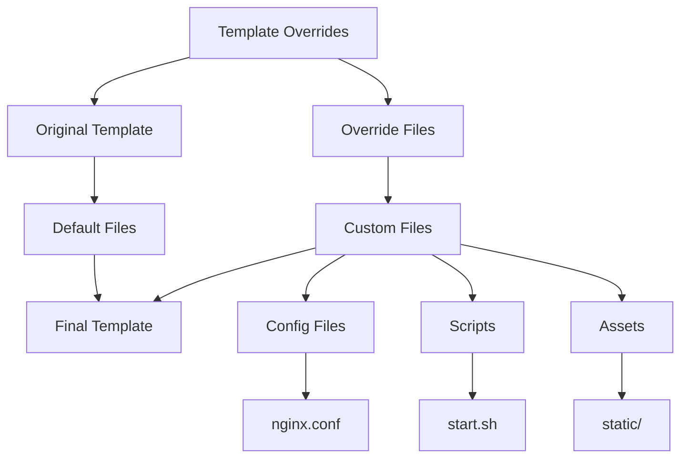

# Template Overrides

This example shows how to override specific files within a template while maintaining the rest of the template's functionality.



## Configuration

```nix
# configuration.nix
{
  services.nix-mox.templates = {
    enable = true;
    templates = [ "web-server" ];
    templateVariables = {
      admin_user = "override-admin";
      domain = "should-not-be-used.com";
    };
    templateOverrides = {
      "web-server" = {
        # Override specific files
        files = ./my-web-server-overrides;
        
        # Override specific paths
        paths = [
          "nginx/conf.d"
          "scripts"
          "static"
        ];
        
        # Override specific file types
        fileTypes = [
          "*.conf"
          "*.sh"
          "*.html"
        ];
        
        # Override with conditions
        conditions = {
          "nginx/conf.d/*.conf" = "environment == 'production'";
          "scripts/*.sh" = "debug_mode == true";
        };
      };
    };
  };
}
```

## Override Structure

```
my-web-server-overrides/
├── nginx/
│   ├── conf.d/
│   │   ├── default.conf
│   │   └── ssl.conf
│   └── nginx.conf
├── scripts/
│   ├── start.sh
│   └── healthcheck.sh
├── static/
│   ├── index.html
│   └── assets/
│       ├── css/
│       └── js/
└── info.txt
```

## Override Patterns

### 1. Configuration Overrides

```nginx
# my-web-server-overrides/nginx/conf.d/default.conf
server {
    listen 80;
    server_name @domain@;
    
    # Custom configuration
    location / {
        root /var/www/custom;
        try_files $uri $uri/ /index.html;
    }
    
    # Custom error pages
    error_page 404 /404.html;
    error_page 500 502 503 504 /50x.html;
}
```

### 2. Script Overrides

```bash
# my-web-server-overrides/scripts/start.sh
#!/bin/bash
echo "Starting custom web server for @domain@"
echo "Environment: @environment@"
echo "Debug mode: @debug_mode@"

# Custom startup logic
if [ "@debug_mode@" = "true" ]; then
    nginx -g 'daemon off;'
else
    nginx
fi
```

### 3. Asset Overrides

```html
<!-- my-web-server-overrides/static/index.html -->
<!DOCTYPE html>
<html>
<head>
    <title>@domain@ - Custom Site</title>
    <link rel="stylesheet" href="/assets/css/custom.css">
</head>
<body>
    <h1>Welcome to @domain@</h1>
    <p>Admin: @admin_user@</p>
</body>
</html>
```

## Override Rules

### File Matching

- Files must match the original template structure
- Only specified files are overridden
- Other template files remain unchanged
- Variables still work in overridden files

### Path Matching

- Override entire directories
- Override specific file patterns
- Override based on conditions
- Maintain directory structure

### Condition Matching

- Override based on environment
- Override based on variables
- Override based on file type
- Override based on custom logic

## Use Cases

### 1. Custom Error Pages

```nix
templateOverrides = {
  "web-server" = {
    files = ./custom-errors;
    paths = ["nginx/error_pages"];
  };
};
```

### 2. Custom SSL Configuration

```nix
templateOverrides = {
  "web-server" = {
    files = ./custom-ssl;
    paths = ["nginx/ssl"];
    conditions = {
      "nginx/ssl/*.conf" = "enableSSL == true";
    };
  };
};
```

### 3. Custom Monitoring

```nix
templateOverrides = {
  "web-server" = {
    files = ./custom-monitoring;
    paths = ["scripts/monitoring"];
    conditions = {
      "scripts/monitoring/*.sh" = "enableMonitoring == true";
    };
  };
};
```

## Expected Outcome

After applying this configuration:

- The template will use your custom files
- Variables will be substituted in overrides
- Other template features remain functional
- Your customizations take precedence

## Verification

1. Check overridden files:

   ```bash
   ls -R /etc/nginx/conf.d/
   ```

2. Verify variable substitution:

   ```bash
   grep -r "@variable_name@" /etc/nginx/
   ```

3. Test custom scripts:

   ```bash
   /etc/nginx/scripts/start.sh
   ```

## Next Steps

- Try [Template Variables](../05-variables) in your overrides
- Learn about [Template Composition](../03-composition) with overrides
- Explore [Template Inheritance](../04-inheritance) with custom files
