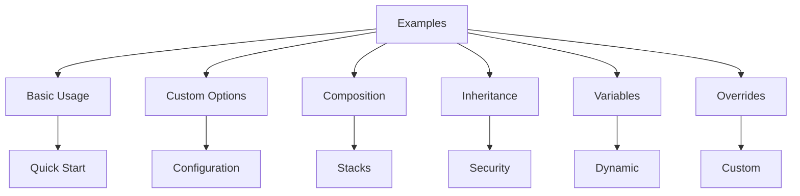

# nix-mox Examples

Welcome to the nix-mox examples collection! These examples demonstrate how to use nix-mox effectively for various use cases.

## Overview

## Example Categories

### 1. Basic Usage

- **Path**: `01-basic-usage/`
- **Purpose**: Get started with nix-mox
- **Key Features**:
  - Simple template deployment
  - Basic configuration
  - Quick start guide
- **Use Cases**:
  - First-time setup
  - Learning the basics
  - Simple deployments

### 2. Custom Options

- **Path**: `02-custom-options/`
- **Purpose**: Configure templates for specific needs
- **Key Features**:
  - Environment-specific settings
  - Multi-site configurations
  - Advanced features
- **Use Cases**:
  - Development/Production environments
  - Multi-site deployments
  - Custom configurations

### 3. Template Composition

- **Path**: `03-composition/`
- **Purpose**: Build complex application stacks
- **Key Features**:
  - Web application stacks
  - Database configurations
  - Monitoring setups
- **Use Cases**:
  - Full-stack applications
  - Microservices
  - Production environments

### 4. Template Inheritance

- **Path**: `04-inheritance/`
- **Purpose**: Extend and customize templates
- **Key Features**:
  - Security templates
  - Base configurations
  - Feature extensions
- **Use Cases**:
  - Secure deployments
  - Feature-rich templates
  - Custom extensions

### 5. Template Variables

- **Path**: `05-variables/`
- **Purpose**: Dynamic configuration management
- **Key Features**:
  - Dynamic configurations
  - Environment variables
  - Secret management
- **Use Cases**:
  - Environment-specific configs
  - Secret management
  - Dynamic deployments

### 6. Template Overrides

- **Path**: `06-overrides/`
- **Purpose**: Customize template behavior
- **Key Features**:
  - Custom configurations
  - File replacements
  - Conditional overrides
- **Use Cases**:
  - Custom deployments
  - Special configurations
  - Conditional features

## Getting Started

1. Choose an example that matches your needs
2. Review the example's README.md
3. Follow the configuration steps
4. Test the deployment
5. Customize as needed

## Best Practices

- Start with basic usage examples
- Review the diagrams for visual understanding
- Follow the verification steps
- Check troubleshooting guides if needed
- Use composition for complex setups
- Leverage inheritance for security

## Contributing

We welcome contributions to our examples! Please follow these guidelines:

1. Use clear, concise documentation
2. Include visual diagrams
3. Provide practical use cases
4. Add verification steps
5. Include troubleshooting guides

## Next Steps

- Review the [main documentation](../USAGE.md)
- Check the [architecture guide](../ARCHITECTURE.md)
- Explore the [roadmap](../ROADMAP.md)
